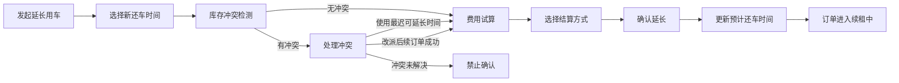

## 版本记录

| 版本 | 日期 | 调整概括 |
| --- | --- | --- |
| V1.0 | 2026-06-25 | 补充 PRD 版本记录区块，后续每次调整本文档时同步记录版本号、日期与调整概括。 |

## 1. 文档概述

### 1.1 背景
延长用车是门市租车订单在履约中调整预计还车时间的业务动作。客户在用车过程中因行程变化需要延后还车时，门店需要同时处理库存占用、续租费用、补充协议、收款方式和后续订单影响，确保车辆排期、客户费用和订单状态一致。

### 1.2 目标
* **时间可控**：延长后的预计还车时间必须晚于当前预计还车时间，并同步更新车辆占用时段。
* **库存可控**：确认延长前必须校验当前车辆在延长时段内是否存在后续订单冲突。
* **费用清晰**：续租费用进入费用中心，支持立即收款或还车时结算。
* **状态一致**：续租确认成功后，订单主状态进入 `renewing`；未确认前不改变订单主状态。
* **风险闭环**：逾期后补办续租、长时间续租、高金额续租和风险客户续租必须执行收款或风控校验。

### 1.3 页面入口
* 订单详情页顶部操作栏：主状态为 `renting`、`renewing` 时展示“延长用车”。
* 订单详情页顶部操作栏：主状态为 `overdue` 时展示“补办续租”，需通过逾期续租风控校验后提交。
* 门市租车订单列表：主状态为 `renting`、`renewing` 的订单展示“延长”快捷操作；主状态为 `overdue` 的订单展示“补办续租”快捷操作。
* 对应原型文件：`order_detail.html`、`store_orders.html`。

---

## 2. 状态与入口规则

| 场景 | 规则 |
| :--- | :--- |
| 允许延长用车 | 订单主状态为 `renting`、`renewing`。 |
| 允许补办续租 | 订单主状态为 `overdue`，且门店具备逾期续租处理权限。 |
| 禁止延长用车 | 订单主状态为 `pending_payment`、`reserved`、`pickup_overdue`、`inspecting`、`settlement_pending`、`payment_due`、`refund_pending`、`completed`、`cancelled`、`closed`。 |
| 打开延长用车弹窗 | 不改变订单主状态。 |
| 关闭延长用车弹窗 | 未确认延长时不改变订单主状态，不更新预计还车时间，不生成续租费用项。 |
| 确认延长成功 | 更新预计还车时间，延长车辆占用时段，生成续租费用项和操作记录，订单主状态更新为 `renewing`。 |
| 续租中再次延长 | 以当前预计还车时间为基准继续延长，订单主状态保持 `renewing`。 |
| 续租中还车 | 进入还车流程，验车数据提交后订单进入 `settlement_pending`。 |
| 逾期补办续租成功 | 订单主状态由 `overdue` 更新为 `renewing`，新预计还车时间生效。 |
| 逾期补办续租失败 | 订单保持 `overdue`，后续还车时按逾期费用结算。 |

### 2.1 状态流转口径

| 流转 | 触发时机 | 处理规则 |
| :--- | :--- | :--- |
| `renting` -> `renewing` | 用车中订单确认延长用车成功。 | 预计还车时间延后，车辆占用时段延长，续租费用进入费用中心。 |
| `renewing` -> `renewing` | 续租中订单再次确认延长用车成功。 | 以当前预计还车时间为基准继续延长，追加新的续租费用项和操作记录。 |
| `overdue` -> `renewing` | 逾期未还订单通过补办续租校验并确认成功。 | 原逾期时段按续租费用口径处理，订单从逾期风险回到续租中。 |
| `renewing` -> `settlement_pending` | 续租中订单提交还车验车数据。 | 车辆视为已还，进入最终费用结算。 |

`renewing` 表示订单已经确认延长后的履约状态，不表示延长用车弹窗正在办理中。门店打开弹窗、选择时间、查看费用或关闭弹窗时，订单不进入 `renewing`。

---

## 3. 延长用车流程



### Step 1 选择新还车时间

| 字段 | 类型 | 必填 | 说明 |
| :--- | :--- | :--- | :--- |
| 当前预计还车时间 | 只读 | 是 | 展示订单当前预计还车时间。 |
| 新预计还车时间 | 日期时间 | 是 | 必须晚于当前预计还车时间。 |
| 延长时长 | 系统计算 | 是 | 新预计还车时间 - 当前预计还车时间，按计费单位向上取整。 |
| 备注说明 | 文本 | 否 | 记录客户申请原因、门店说明或特殊约定。 |

#### 1.1 时间限制
* 新预计还车时间必须晚于当前预计还车时间。
* 最小延长计费单位为 1 小时，不足 1 小时按 1 小时计费。
* 本期不限制单次最大延长天数；只要库存冲突、费用、风控和权限校验通过，即可确认延长。

### Step 2 库存冲突检测
系统必须校验当前车辆从“当前预计还车时间”到“新预计还车时间 + 订单间隔时间”之间是否存在后续订单。订单间隔时间同时承担整备、清洁和检查缓冲作用。

| 检测项 | 规则 |
| :--- | :--- |
| 检测车辆 | 当前订单已交付车辆。 |
| 检测时段 | 当前预计还车时间至新预计还车时间 + 订单间隔时间。 |
| 订单间隔/整备缓冲 | 使用租赁业务规则中的订单间隔时间，默认 60 分钟。 |
| 冲突对象 | 后续已预订、待取车、已锁车且占用同一车辆的订单。 |

#### 2.1 无冲突
* 页面展示“库存可用”。
* 允许进入费用试算和确认延长。

#### 2.2 有冲突
* 页面展示后续冲突订单号、后续取车时间、冲突车辆和最迟可延长时间。
* 最迟可延长时间 = 后续订单预计取车时间 - 订单间隔时间。
* 门店可选择“使用最迟可延长时间”，系统将新预计还车时间改为最迟可延长时间。
* 门店可选择“改派后续订单”，系统先进入后续订单改派校验。
* 冲突未解决时，“确认延长”按钮禁用。

#### 2.3 改派后续订单
改派后续订单必须同时满足以下条件：

| 条件 | 规则 |
| :--- | :--- |
| 后续订单允许改派 | 后续订单尚未取车，未进入验车中、用车中、结算中或终态。 |
| 有可用车辆 | 同车组或可升级车组存在可用车辆，并满足后续订单时间段占用。 |
| 权限满足 | 店长或管理员可执行强制改派；普通店员仅可发起改派申请。 |
| 费用影响明确 | 发生升降级价差时写入后续订单改派记录。 |

改派成功后，当前订单可继续确认延长；改派失败时，当前订单仍不能超过最迟可延长时间。

### Step 3 费用试算

```text
续租计费时段 = 当前预计还车时间 至 新预计还车时间
续租租金 = 按订单计费快照中的车组标准价、行销优惠方案快照、时租转日租规则计算新增租期金额
逾期补办续租费用 = 原预计还车时间至新预计还车时间的续租租金
```

| 费用项 | 规则 |
| :--- | :--- |
| 续租租金 | 按订单计费快照计算，展示新增计费时段、计费小时/天数、车组标准价、行销优惠方案折扣和金额。 |
| 平假日折扣 | 车组标准价不区分平日/假日；行销优惠方案区分平日/假日折扣时，以新增计费周期的起始时间判断适用折扣。 |
| 优惠继承 | 当前订单已生效的行销优惠方案按订单计费快照参与试算；个人订单可继承订单计费快照中的优惠券和积分抵扣，企业身份订单不支持优惠券和积分。后续配置变化不影响已创建订单。 |
| 逾期时段 | 逾期补办续租成功时，原逾期时段按续租费用处理，不重复生成逾期费。 |
| 费用归属 | 续租费用归属租期费用 `rental`，进入费用中心。 |

续租确认成功时，系统生成事件级续租计费快照 `extensionSnapshotId`。续租快照记录本次新增计费时段、订单级基线快照版本、事件发生时命中的 `priceVersionId`、`marketingPlanVersionId`、`rentalRuleVersionId`、续租试算结果、结算方式和操作时间。后续还车结算读取续租事件快照，不因续租后标准价、行销方案或规则调整而变化，也不覆盖原订单基线快照。

### Step 4 结算方式
延长用车支持“立即收款”和“还车时结算”两种结算方式。企业月结订单不发起续租收款，续租费用随还车最终应收统一进入企业月结账单。

| 结算方式 | 规则 | 状态影响 |
| :--- | :--- | :--- |
| 立即收款 | 确认延长前完成续租费用收款，收款成功后更新预计还车时间。 | 续租费用项状态为 `paid`，订单进入或保持 `renewing`。 |
| 还车时结算 | 确认延长时生成待收续租费用项，还车结算时统一处理。 | 续租费用项状态为 `pending`，订单进入或保持 `renewing`。 |
| 企业月结 | 确认延长时生成月结续租费用项，不展示收款入口。 | 续租费用项状态为 `monthly_billing`，订单进入或保持 `renewing`。 |

以下场景必须使用“立即收款”：
* 订单当前状态为 `overdue`，需要补办续租。
* 延长时长超过门店配置阈值，原型按超过 24 小时处理。
* 续租金额超过门店配置阈值，原型按超过 1000 元处理。
* 客户存在黑名单、证件异常、违约或高风险标签。

企业月结订单不受“必须立即收款”规则影响；逾期补办、长时长或高金额续租仍需通过风控和权限校验，费用统一进入企业月结账单。

### Step 5 确认延长
点击“确认延长”前，系统校验：

| 校验项 | 规则 |
| :--- | :--- |
| 时间校验 | 新预计还车时间晚于当前预计还车时间。 |
| 库存校验 | 无车辆占用冲突，或冲突已通过最迟可延长时间、后续订单改派解决。 |
| 费用校验 | 续租费用已完成试算。 |
| 收款校验 | 客户自付订单必须立即收款的场景已完成收款；企业月结订单不校验客户收款。 |
| 权限校验 | 逾期补办续租、强制改派后续订单需满足权限。 |

校验通过后，系统执行：

| 动作 | 结果 |
| :--- | :--- |
| 更新订单时间 | `预计还车时间` 更新为新预计还车时间。 |
| 更新车辆占用 | 当前车辆占用时段延长至新预计还车时间。 |
| 生成费用项 | 新增 `extension_rent` 续租租金费用项。 |
| 生成资金记录 | 立即收款时生成 `payment` 交易；还车时结算和企业月结时暂不生成客户收款交易。 |
| 更新订单状态 | `renting` 或 `overdue` 更新为 `renewing`；`renewing` 保持 `renewing`。 |
| 生成补充协议 | 记录新还车时间、费用、结算方式和客户确认方式。 |
| 写入操作记录 | 记录操作人、时间、原还车时间、新还车时间、费用和备注。 |

---

## 4. 费用中心规则

| 字段 | 规则 |
| :--- | :--- |
| 费用类型 | `extension_rent`。 |
| 费用名称 | 续租租金。 |
| 费用阶段 | `rental`。 |
| 费用来源 | 系统费用 `system`。 |
| 状态 | 立即收款为 `paid`；还车时结算为 `pending`；企业月结为 `monthly_billing`。 |
| 已收金额 | 立即收款等于续租费用金额；还车时结算和企业月结为 0。 |
| 交易记录 | 立即收款生成 `payment`；还车时结算和企业月结不生成客户交易。 |
| 发票 | 按费用中心统一发票规则处理。 |

还车结算时，系统将所有未结清的续租费用纳入最终账单。企业月结订单的续租费用纳入企业挂账金额。续租费用不改变取车阶段已处理完成的预授权口径。

---

## 5. 异常处理

| 场景 | 处理规则 |
| :--- | :--- |
| 未选择新还车时间 | 禁止确认延长。 |
| 新还车时间不晚于当前预计还车时间 | 禁止确认延长。 |
| 库存冲突未解决 | 禁止确认延长。 |
| 后续订单改派失败 | 当前订单只能使用最迟可延长时间。 |
| 必须立即收款但未收款 | 禁止确认延长。 |
| 立即收款失败 | 订单时间不更新，订单状态不变化，续租费用项不生效。 |
| 企业月结续租 | 不展示确认收款按钮，确认延长后生成月结续租费用项。 |
| 逾期补办续租未通过风控 | 订单保持 `overdue`，后续还车时按逾期费用结算。 |
| 弹窗关闭未确认 | 订单状态、预计还车时间、费用项均不变化。 |

---

## 6. UI/UX 规则

* 延长用车弹窗展示当前预计还车时间、新预计还车时间、延长时长、库存检测结果、费用试算和结算方式。
* 费用试算区展示计费时长、计费单价、续租租金、是否必须立即收款。
* 库存冲突区展示后续订单号、后续取车时间、最迟可延长时间和改派后续订单入口。
* 结算方式使用单选项展示“立即收款”和“还车时结算”；必须立即收款时，“还车时结算”置灰并展示原因。
* 企业月结订单结算方式展示“企业月结”，说明续租费用随还车最终应收进入企业账单，不展示立即收款和还车时结算单选项。
* 确认按钮在时间、库存、费用、收款任一条件不满足时置灰。
* 确认成功后，订单头部状态立即更新为“续租中”，预计还车时间同步刷新。
* 订单列表对 `renting`、`renewing` 展示“延长”操作，对 `overdue` 展示“补办续租”操作。

---

## 7. 验收标准

| 场景 | 验收标准 |
| :--- | :--- |
| 用车中延长 | `renting` 订单可打开延长用车弹窗，确认成功后订单状态变为 `renewing`。 |
| 续租中再次延长 | `renewing` 订单可再次延长，确认后仍保持 `renewing`。 |
| 逾期补办续租 | 客户自付的 `overdue` 订单可打开补办续租弹窗，必须立即收款并通过风控后才能变为 `renewing`。 |
| 企业月结续租 | 企业月结订单可打开延长用车弹窗，确认后不发起客户收款，续租费用进入还车最终企业挂账。 |
| 弹窗关闭 | 未确认延长时，订单状态、预计还车时间和费用项均不变化。 |
| 时间校验 | 新预计还车时间不晚于当前预计还车时间时不能确认。 |
| 延长天数 | 本期不限制单次最大延长天数。 |
| 库存无冲突 | 无后续占用时可确认延长。 |
| 库存有冲突 | 冲突未解决时不能确认延长。 |
| 使用最迟可延长时间 | 点击后新预计还车时间自动改为最迟可延长时间，冲突解除。 |
| 改派后续订单 | 后续订单改派成功后，当前订单可继续确认延长。 |
| 立即收款 | 选择立即收款并收款成功后，生成续租费用项和收款交易。 |
| 还车时结算 | 选择还车时结算后，生成待收续租费用项，并在还车结算中纳入最终账单。 |
| 费用中心 | 续租确认成功后，费用中心展示“续租租金”费用项。 |
| 操作记录 | 续租确认成功后，订单操作记录展示原还车时间、新还车时间、费用、结算方式和操作人。 |
