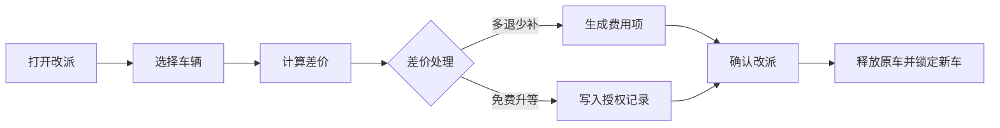

## 版本记录

| 版本 | 日期 | 调整概括 |
| --- | --- | --- |
| V1.0 | 2026-06-25 | 补充 PRD 版本记录区块，后续每次调整本文档时同步记录版本号、日期与调整概括。 |

## 1. 文档概述

### 1.1 背景
改派用于处理门市租车订单中的换车、升级、降级和门店车辆调整。改派本身不改变订单主状态，但会改变订单绑定车辆、派车状态、费用明细和操作记录。

### 1.2 目标
* **车辆可交付**：当原车辆不可交付、客户要求换车或门店需要调整车辆时，门店可快速改派。
* **费用可追溯**：改派产生的差价、退费或免费升等均进入费用中心和操作记录。
* **结算点清晰**：发车前改派在取车时处理差价；用车中改派在还车时处理差价；企业月结订单的改派差价统一进入企业月结账单。
* **权限可控**：免费升等、差价减免和强制改派必须记录操作原因和操作人。

### 1.3 页面入口
* 订单详情页顶部“改派”按钮。
* 延长用车库存冲突时，详情页或延长用车弹窗提供“改派后续订单”入口。
* 改还车门市/转单命中原还车门市后续预约冲突时，转单弹窗提供“快捷改派后续订单”入口。
* 调度页面可跳转订单详情页并打开改派弹窗。

---

## 2. 适用状态

| 主状态 | 是否允许改派 | 处理口径 |
| :--- | :--- | :--- |
| `pending_payment` | 否 | 订单未确认资金，不允许锁定新车辆。 |
| `reserved` | 是 | 发车前改派，客户自付订单差价进入取车尾款；企业月结订单差价进入最终企业挂账。 |
| `pickup_overdue` | 是 | 逾期未取仍可办理取车，客户自付订单差价进入取车尾款；企业月结订单差价进入最终企业挂账。 |
| `inspecting` | 是 | 取车办理中改派只能由当前取车操作锁持有人在取车流程内执行；客户自付订单差价进入取车尾款，企业月结订单差价进入最终企业挂账。 |
| `renting` | 是 | 用车中换车，差价进入还车结算。 |
| `renewing` | 是 | 续租中换车，差价进入还车结算。 |
| `overdue` | 是 | 逾期未还换车需记录风控备注，差价进入还车结算。 |
| `accident_processing` | 是 | 本期事故和改派不做系统联动，是否需要换车由门店、调度或客服线下判断；具备权限时可人工改派，差价进入还车结算或企业月结账单。 |
| `settlement_pending`、`payment_due`、`refund_pending` | 否 | 已进入还车结算，不再改派。 |
| `completed`、`cancelled`、`no_show`、`rejected`、`closed` | 否 | 终态订单不允许改派。 |

---

## 3. 改派场景

| 场景 | 触发原因 | 费用处理 |
| :--- | :--- | :--- |
| 同组换车 | 原车故障、未整备、客户指定同组车辆 | 订单价格不变。 |
| 升级换车 | 客户主动升级或门店免费升等 | 客户主动升级收取差价；门店免费升等不收差价。 |
| 降级换车 | 客户同意降级或门店资源不足 | 生成退费项或在还车结算中抵扣。 |
| 用车中换车 | 租期中车辆故障、事故、临时换车 | 按剩余租期计算差价，进入还车结算。 |
| 后续订单改派 | 当前订单延长用车导致后续订单库存冲突 | 改派被影响的后续订单，不改变当前订单费用。 |
| 转单冲突改派 | 当前订单改还车门市后，原还车门市已有后续预约占用当前车辆 | 改派被影响的后续订单，不改变当前订单费用；当前订单转单费用仍按新旧还车门市差额计算。 |

改派原因使用固定枚举，前端、后端、操作记录、履约事件和报表统计统一使用同一套原因值。

| 原因 | 使用场景 |
| :--- | :--- |
| 原车故障 | 原车辆临时故障、不可安全交付或需要维修。 |
| 原车未整备完成 | 原车辆清洁、检查、补油/充电或其他整备未完成。 |
| 原车事故/不可交付 | 原车辆发生事故、停运、被管控或其他不可交付情况。 |
| 客户要求升级 | 客户主动要求升级车组或车型。 |
| 客户同意降级 | 资源不足或门店协调后，客户同意降级用车。 |
| 门店免费升等 | 门店责任、补偿或服务体验原因，不向客户收取升级差价。 |
| 车辆调度调整 | 门店或调度人员基于车辆排程、里程、营收或运营需要调整车辆。 |
| 续租冲突改派后续订单 | 当前订单延长用车导致后续订单冲突，需要改派后续订单。 |
| 转单冲突改派后续订单 | 当前订单改还车门市/转单导致原还车门市后续预约冲突，需要改派后续订单。 |
| 其他 | 上述原因无法覆盖时使用，必须填写备注。 |

---

## 4. 改派流程



### Step 1 进入改派
* 系统校验订单主状态是否允许改派。
* 系统校验订单是否存在未结清费用；存在未结清费用时，门店需先处理费用或由店长授权继续。
* 系统展示当前车辆、当前车组、当前日租金、当前优惠方案和当前绑定门店。

### Step 2 选择车辆
页面提供两种选车方式：

| 方式 | 规则 |
| :--- | :--- |
| 智能推荐 | 系统按同车组、可用库存、同门店、免费升等、客户偏好排序推荐车辆。 |
| 手动筛选 | 门店选择车组和具体车辆，系统只展示改派时段内无冲突且状态可用的车辆。 |

车辆展示信息包含车型、车牌、车组、所属车行、当前所在门市、当前所在据点、可用时段、车辆状态、价格、推荐标签和库存冲突提示。

本期改派目标车辆必须在当前订单可操作组织范围内，并且不允许跨车行调度。订单门店、车行角色账号只能在其数据权限范围内选择车辆；营运角色账号可按权限查看更大范围车辆，但确认改派时仍必须满足“不跨车行”的限制。若需要跨车行协调，本期通过线下处理，不在订单改派流程内完成。

发车前改派优先展示订单取车门市及其下属据点可交付车辆；用车中改派优先展示当前车辆所在门市、当前还车门市或调度员可协调的同车行门市车辆。门市租车订单展示车辆当前所在据点，方便门店安排备车或交接。

### Step 3 计算差价

#### 发车前改派
```text
个人订单新金额 = 新车组标准租金 + 增值服务费用 - 行销优惠方案抵扣 - 积分抵扣 - 优惠券抵扣
企业订单新金额 = 新车组标准租金 + 增值服务费用 - 企业资格行销优惠方案抵扣
改派差价 = 对应订单新金额 - 原订单金额
```

#### 用车中改派
```text
改派差价 = 新车组剩余租期金额 - 原车组剩余租期金额
```

* 同组换车时差价为 0。
* 跨组换车时，系统按订单客户类型和企业资格重新匹配目标车组可用的行销优惠方案。
* 企业身份订单不支持优惠券和积分，改派试算不继承、不重新匹配优惠券和积分。
* 发车前改派按完整订单租期重新试算新订单金额；用车中改派只计算剩余租期，不重算已使用租期。
* 新车组剩余租期金额按门市租车计费规则计算，不足 1 小时按 1 小时，剩余计费小时达到第 5 小时起按 1 天计费。
* 车组标准价不区分平日/假日；行销优惠方案区分平日/假日折扣时，以剩余计费周期的起始时间判断适用折扣。
* 改派确认时，系统生成事件级改派计费快照 `redirectionSnapshotId`。该快照记录订单级基线快照版本、目标车组 `priceVersionId`、目标行销方案 `marketingPlanVersionId`、事件发生时命中的租赁规则 `rentalRuleVersionId`、目标车组标准价、目标行销优惠方案、差价计算方式和操作时间。该事件快照只用于本次改派差额和后续还车结算追溯，不覆盖原订单基线快照。
* 改派确认时同时保存改派展示快照，包含原车辆和新车辆的车牌、车组名称、车型名称、车辆归属门店、实际交接门店、改派原因、改派经办人和操作时间。后续车辆、车组、车型或门店资料调整不改写该改派记录。
* 差价为正数时形成客户应补金额；差价为负数时形成客户应退金额。

### Step 4 差价处理

| 处理方式 | 规则 | 费用中心结果 |
| :--- | :--- | :--- |
| 多退少补 | 按改派差价调整订单费用。 | 差价为正生成 `redirection_fee`；差价为负生成 `redirection_refund`。 |
| 免费升等 | 门店责任或补偿场景，不向客户收取升级差价。 | 不生成应收差价，写入免费升等操作记录。 |

客户自付订单发车前改派差价进入取车尾款，用车中改派差价进入还车结算。企业月结订单改派差价不触发客户收款或退款，统一进入企业月结账单。改派确认时不直接触发收款或退款。

### Step 5 确认改派
确认后系统执行以下动作：

| 动作 | 结果 |
| :--- | :--- |
| 释放原车辆 | 原车辆恢复可排期状态，已硬锁车辆解除订单绑定。 |
| 锁定新车辆 | 新车辆写入订单派车信息，派车状态更新为 `manual_reassigned` 或 `upgraded`。 |
| 写入改派记录 | 记录原车辆、新车辆、差价、处理方式、原因、操作人和时间。 |
| 写入费用中心 | 多退少补场景生成改派差价或改派退费费用项。 |
| 写入操作日志 | 改派、免费升等、后续订单改派均写入操作日志。 |

---

## 5. 费用中心规则

| 费用类型 | 字段值 | 金额方向 | 生成时机 |
| :--- | :--- | :--- | :--- |
| 改派差价 | `redirection_fee` | 正向应收 | 新车辆价格高于原车辆，且选择多退少补。 |
| 改派退费 | `redirection_refund` | 负向应收 | 客户自付订单新车辆价格低于原车辆，且选择多退少补。 |
| 免费升等 | 不生成费用项 | 0 | 选择免费升等并通过权限校验。 |

企业月结订单不生成客户补缴或退款动作。改派差价为正时记录为企业月结调增，差价为负时记录为企业月结调减，最终随还车结算后的企业应收统一进入企业账单。

### 5.1 发车前改派
* 改派差价影响订单总额和取车应收尾款。
* 下单阶段预授权押金不自动重算；取车时按当前订单总额和配置校验预授权是否满足要求。
* 差价在取车尾款中统一补收或抵扣。
* 企业月结订单不计算取车尾款，改派差价记录为租期费用，最终随还车结算进入企业挂账。

### 5.2 用车中改派
* 改派差价不影响已完成的取车收款。
* 差价费用项进入还车结算。
* 还车时按最终 `balanceDue` 统一补缴或退款。
* 企业月结订单还车时按最终企业挂账金额统一入账，不生成补缴或退款。

---

## 6. 权限与审计

改派权限按功能权限和组织范围共同控制，不固定绑定某个角色名称。店员、店长、调度员、管理员是页面说明中的角色示例；实际是否可操作以后台角色权限、所属车行/门市/据点数据范围和订单当前操作锁为准。

| 操作 | 权限 |
| :--- | :--- |
| 同组改派 | 具备订单改派权限且在订单组织范围内。 |
| 付费升级 | 具备订单改派权限且在订单组织范围内。 |
| 降级退费 | 具备降级退费或费用调整权限。 |
| 免费升等 | 具备免费升等权限。 |
| 事故期间改派 | 具备订单改派权限且在订单组织范围内；本期不要求系统先完成事故登记联动，由人工线下判断是否需要换车。 |
| 后续订单改派 | 具备调度改派权限且在后续订单组织范围内。 |
| 取车中改派 | 必须是当前取车操作锁持有人，并具备订单改派权限。 |

以下动作必须写入审计日志：
* 确认改派。
* 免费升等。
* 降级退费。
* 事故期间改派。
* 后续订单改派。
* 强制改派库存冲突车辆。

---

## 7. 异常处理

| 场景 | 处理规则 |
| :--- | :--- |
| 目标车辆被占用 | 提交时提示库存冲突，刷新可用车辆列表。 |
| 目标车辆状态不可用 | 禁止确认改派。 |
| 存在未结清费用 | 阻断改派，或由店长授权继续并写入原因。 |
| 免费升等未填写原因 | 禁止确认。 |
| 降级退费无权限 | 禁止确认。 |
| 事故期间换车 | 本期事故和改派不做系统联动，系统不强制要求先登记事故；门店、调度或客服人工判断需要换车时，可在具备权限后走订单改派流程。 |
| 后续订单改派失败 | 当前订单延长或改派不回滚，后续订单进入人工调度队列。 |

---

## 8. UI/UX 规则

* 改派弹窗展示当前车辆和目标车辆，避免门店误选。
* 车辆列表中展示推荐标签、价格差异、可用状态和所在门店。
* 差价为正展示“需补款”，差价为负展示“需退款”，差价为 0 展示“价格不变”。
* 选择免费升等时，页面提示“不向客户收取差价”，并要求填写原因。
* 选择多退少补时，页面展示差价将进入取车尾款或还车结算。
* 企业月结订单差价展示为“进入企业月结账单”，不展示“需补款”“需退款”操作按钮。
* 确认改派后，改派记录区域自动展开并展示最新记录。

---

## 9. 验收标准

| 场景 | 验收标准 |
| :--- | :--- |
| 发车前同组改派 | `reserved` 订单改派同组车辆后价格不变，派车状态更新为人工改派。 |
| 发车前升级 | 新车辆价格更高时生成改派差价，取车尾款增加。 |
| 发车前降级 | 新车辆价格更低时生成改派退费，取车尾款抵扣。 |
| 企业月结改派 | 企业月结订单改派产生的正负差价进入最终企业挂账，不触发客户收款或退款。 |
| 免费升等 | 店长选择免费升等后不生成应收差价，操作记录写入免费升等原因。 |
| 用车中改派 | `renting`、`renewing`、`overdue` 订单改派后，差价进入还车结算。 |
| 状态拦截 | `pending_payment`、结算中状态和终态订单不允许改派。 |
| 库存冲突 | 目标车辆不可用时不能确认改派。 |
| 费用记录 | 多退少补确认后，费用中心新增改派差价或改派退费。 |
| 操作记录 | 每次确认改派都写入原车辆、新车辆、差价、原因和操作人。 |
