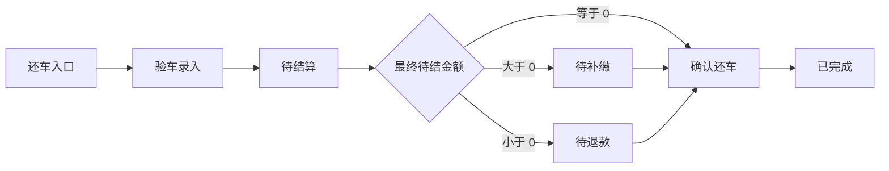

## 版本记录

| 版本 | 日期 | 调整概括 |
| --- | --- | --- |
| V1.0 | 2026-06-25 | 补充 PRD 版本记录区块，后续每次调整本文档时同步记录版本号、日期与调整概括。 |

## 1. 文档概述

### 1.1 背景
还车是门市租车订单履约闭环的关键节点。门店员工需要在客户归还车辆时完成车辆查验、里程油量录入、异常损伤确认、费用自动计算、补缴/退款/减免处理和还车确认，确保车辆资产、客户责任和财务账目清晰闭环。

### 1.2 目标
* **标准化还车**：通过分步向导完成验车录入、费用结算和还车确认。
* **自动算费**：根据实际还车时间、实际行驶里程、还车油量/电量、订单当前还车门市和车损情况生成结算账单；归还据点只用于记录车辆最终停放位置，不作为异地还车费或调度费判断条件。
* **差额结算**：客户自付订单取车时已补足租金，还车阶段只处理租期结束后的差额费用、减免、补缴和退款。
* **责任留痕**：对比取车照片和还车照片，记录新增损伤、客户确认和经办人操作。
* **状态闭环**：车辆已还、账单已平并完成确认后，订单进入 `completed`。

### 1.3 页面入口
* 门市租车订单列表：主状态为 `renting`、`renewing`、`overdue`、`accident_processing` 的订单展示“还车”按钮。
* 门市租车订单列表：主状态为 `settlement_pending` 的订单展示“继续结算”按钮。
* 门市租车订单列表：主状态为 `payment_due` 的订单展示“收款”按钮，主状态为 `refund_pending` 的订单展示“退款”按钮。
* 订单详情页：主状态为 `renting`、`renewing`、`overdue`、`accident_processing` 的订单展示“还车”按钮；主状态为 `settlement_pending`、`payment_due`、`refund_pending` 的订单展示“继续结算”按钮。
* 对应原型文件：`order_detail.html`

---

## 2. 状态切换规则

### 2.1 主状态定义

| 主状态 | 业务含义 | 页面动作 |
| :--- | :--- | :--- |
| `renting` 用车中 | 客户正在用车，车辆尚未归还。 | 可发起还车。 |
| `renewing` 续租中 | 客户正在办理或已经进入续租周期。 | 可发起还车。 |
| `overdue` 逾期未还 | 客户超过预计还车时间仍未归还。 | 可发起还车，并保留逾期风险记录。 |
| `accident_processing` 出险处理中 | 订单存在事故或出险记录，车辆可能仍在客户处或已待归还。 | 可处理事故，也可发起还车并纳入事故费用。 |
| `settlement_pending` 待结算 | 车辆已经归还，验车数据已提交，最终账单正在核对或等待门店确认。 | 可继续结算。 |
| `payment_due` 待补缴 | 最终账单已形成，应收金额大于已处理金额，客户仍需补缴。 | 可收款并继续确认还车。 |
| `refund_pending` 待退款 | 最终账单已形成，应退金额大于已处理金额，门店或财务仍需退款。 | 可退款并继续确认还车。 |
| `completed` 已完成 | 账单平衡、还车确认完成，订单归档。 | 不再办理还车，后续费用走追缴流程。 |

### 2.2 状态流转口径

| 流转 | 触发时机 | 处理规则 |
| :--- | :--- | :--- |
| `renting / renewing / overdue / accident_processing` -> `settlement_pending` | 还车 Step 1“验车录入”提交成功。 | 系统已记录实际还车时间、订单当前还车门市、归还据点、还车里程、油量/电量、车况照片、损伤记录和客户签字。此时车辆视为已归还，订单进入待结算。 |
| `settlement_pending` -> `payment_due` | 费用结算页生成或暂存账单，`balanceDue > 0`，且客户未完成补缴。 | 订单进入待补缴，列表展示“收款”。 |
| `settlement_pending` -> `refund_pending` | 费用结算页生成或暂存账单，`balanceDue < 0`，且门店未完成退款。 | 订单进入待退款，列表展示“退款”。 |
| `settlement_pending` -> `completed` | `balanceDue = 0`，门店点击“确认还车”。 | 订单完成，还车结算单生成。 |
| `payment_due` -> `completed` | 客户补缴完成，`balanceDue = 0`，门店点击“确认还车”。 | 订单完成，收款记录写入结算单。 |
| `refund_pending` -> `completed` | 退款处理完成，`balanceDue = 0`，门店点击“确认还车”。 | 订单完成，退款记录写入结算单。 |

### 2.3 退出还车窗口的状态处理

| 操作阶段 | 关闭窗口时的处理 |
| :--- | :--- |
| Step 1 验车录入未提交 | 主状态保持原用车状态，即 `renting`、`renewing`、`overdue` 或 `accident_processing`；还车草稿可保留，但不视为车辆已还。 |
| Step 1 验车录入已提交，进入 Step 2 费用结算 | 订单已经进入 `settlement_pending`，车辆视为已还；返回上一步修改信息不回滚主状态，重新提交后刷新结算快照。 |
| Step 2 费用结算页关闭窗口，`balanceDue > 0` | 订单进入 `payment_due`。 |
| Step 2 费用结算页关闭窗口，`balanceDue < 0` | 订单进入 `refund_pending`。 |
| Step 2 费用结算页关闭窗口，`balanceDue = 0` | 订单保持 `settlement_pending`，等待门店点击“确认还车”。 |
| Step 3 还车完成页关闭窗口 | 订单已进入 `completed`，关闭窗口不再改变状态。 |

### 2.4 还车过程中的车辆状态口径

还车流程中，订单状态与车辆状态分开维护：

- 还车 Step 1“验车录入”提交成功后，订单进入 `settlement_pending`，车辆结束 `renting` 占用并进入内部处理阶段，不得重新参与新的派车候选池。
- 订单处于 `settlement_pending`、`payment_due`、`refund_pending` 时，车辆仍视为还车处理中，不允许重新发车或参与新的硬锁。
- 订单点击“确认还车”后，如车辆仍为 `enabled` 且无需清洁、保养、调度或其他内部处理，车辆营运状态回写为 `idle`。
- 订单点击“确认还车”后，如车辆仍需清洁、保养、调度、还车待整备或其他内部处理，车辆营运状态回写为 `controlled`。
- 车辆在还车完成时若已 `disabled`，则继续保持禁用，不恢复新订单派车资格。

---

## 3. 还车流程



### Step 1 验车录入

#### 1.1 还车基础信息

| 字段 | 类型 | 必填 | 说明 |
| :--- | :--- | :--- | :--- |
| 实际还车时间 | 日期时间 | 是 | 默认当前时间，影响超时费和提前还车退费。 |
| 订单当前还车门市 | 只读展示 | 自动带出 | 订单当前可办理还车的门市。只有订单当前还车门市拥有还车操作权限，不能在还车窗口中手动修改；如需调整，必须先执行“改还车门市/转单”。 |
| 归还据点 | 下拉选择 | 是 | 记录车辆验车后最终停放到还车门市下的哪个据点；同一还车门市下选择不同归还据点不触发异地还车费。 |
| 停车楼层 | 文本 | 否 | 记录车辆停放位置。 |
| 车位号 | 文本 | 否 | 记录车辆停放位置。 |
| 停车位照片 | 图片 | 否 | 用于门店后续寻车和交接。 |

门市租车客户面向订单当前还车门市办理还车。还车窗口不允许店员任意选择其他门市；其他门市默认没有该订单的还车操作入口。归还据点是门店验车后记录的车辆最终停放位置，用于内部资产位置、整备和后续派车，不改变客户订单中的还车门市，也不参与异地还车费或调度费判断。

#### 1.2 改还车门市/转单

客户或门店需要调整还车门市时，必须先执行“改还车门市/转单”。转单完成后，订单当前还车门市更新为新门市，新门市获得订单列表、详情和还车操作权限。

允许操作的订单状态：`reserved`、`pickup_overdue`、`inspecting`、`renting`、`renewing`、`overdue`、`accident_processing`。

不允许操作的订单状态：`settlement_pending`、`payment_due`、`refund_pending`、`completed`、`cancelled`、`closed`、`rejected`、`no_show`。

允许操作的角色范围：取车门市、订单当前还车门市、总部或管理员。

改还车门市/转单本期仅支持同车行范围内处理。目标还车门市必须与订单取车门市或车辆资产所属车行处于同一车行组织范围内；跨车行转单本期不支持。遇到跨车行还车需求时，门店按线下协商处理，系统不提供跨车行转单入口，也不改变订单还车权限。

固定变更原因：

| 原因 | 备注规则 |
| :--- | :--- |
| 客户要求改还车门市 | 可选备注。 |
| 门店协商改还车门市 | 可选备注。 |
| 车辆回流安排 | 可选备注。 |
| 原还车门市无法接收 | 可选备注。 |
| 事故/异常处理需要 | 可选备注。 |
| 其他 | 必填备注。 |

转单确认前，系统必须检查当前订单车辆在原订单当前还车门市是否已经被后续预约订单占用。检查口径如下：

| 检查项 | 规则 |
| :--- | :--- |
| 检查车辆 | 当前订单已绑定或已硬锁定的车辆。 |
| 检查门市 | 转单前的订单当前还车门市。 |
| 检查时点 | 当前订单预计还车时间之后。 |
| 冲突订单 | 后续已预订、待取车、已锁车且占用同一车辆的订单。 |
| 展示信息 | 后续订单号、取车时间、客户、原还车门市、当前车辆、派车状态。 |

存在后续预约冲突时，转单弹窗必须提示“原还车门市存在后续预约”，并提供“快捷改派后续订单”入口。冲突未处理前，不允许确认转单。

快捷改派后续订单沿用订单改派规则：系统为被影响的后续订单重新匹配可用车辆，改派成功后释放原车辆在原还车门市的后续占用，并在当前订单和后续订单中写入操作记录。快捷改派失败时，当前订单不能完成改还车门市，门店需先处理后续订单占用或取消本次转单。

#### 1.3 改还车据点

24 小时自助租车订单需要支持“改还车据点”。改还车据点用于将订单当前还车据点调整到具体自助据点，适用于原据点关闭、暂停、临时不可用或客服人工协商变更场景。

处理口径如下：

- 允许状态与改还车门市一致：`reserved`、`pickup_overdue`、`inspecting`、`renting`、`renewing`、`overdue`、`accident_processing`。
- 允许角色范围与改还车门市一致：取车门市、订单当前还车门市、总部或管理员。
- 若只在同一还车门市下切换据点，不产生异地还车费或调度费差额。
- 若改到其他还车门市下的具体据点，先更新订单当前还车门市，再按改还车门市规则检查后续预约冲突，并按门市口径计算异地还车费差额。
- 本期不自动改据点、不自动取消，关联据点关闭或暂停时，后台和 APP 统一提示“站点已关闭，请联系客服处理”或“站点已暂停，请联系客服处理”，由客服人工处理。

转单费用按以下口径计算：

```text
旧异地还车费 = 取车门市 -> 原订单当前还车门市
新异地还车费 = 取车门市 -> 新订单当前还车门市
调度费差额 = 新异地还车费 - 旧异地还车费
```

差额大于 0 时生成应补费用；差额小于 0 时生成负向费用，进入还车结算抵扣或退款。企业月结订单的差额统一进入企业月结账单。客户自付订单本期不强制在转单时立即收款，差额进入取车尾款或还车结算统一处理。

#### 1.3 仪表数据

| 字段 | 类型 | 必填 | 说明 |
| :--- | :--- | :--- | :--- |
| 还车里程 | 数值 | 是 | 必须大于或等于取车里程。 |
| 还车油量/电量 | 数值 | 是 | 燃油车按 0/8 到 8/8 记录，电车按百分比记录。 |
| 还车备注 | 文本 | 否 | 记录客户说明、车辆异常、门店备注。 |

24 小时自助租车订单在订单详情页还车弹窗中，还车里程、还车油量/电量默认读取车机最新实时值，并展示“默认带入车机值”和同步时间。

处理规则如下：

* 已获取车机实时值时，页面默认带入车机最新里程和油量/电量，后台人员仍可根据现场核对结果手动修改。
* 未获取车机实时值时，页面提示“未获取车机实时值”，允许按现场仪表盘人工录入后继续。
* 提交验车后，以最终确认值写入还车验车记录和还车结算快照；车机默认值只作为默认带入来源，不单独覆盖人工确认结果。
* 该规则仅适用于 24 小时自助租车；有人服务的门市租车仍按店员现场录入为准。

#### 1.4 车况查验
* 外观标准照：前方、后方、左侧、右侧、左前角、右前角。
* 内饰标准照：仪表盘、前排座椅、后排环境。
* 系统展示取车照片作为比对基准。
* 新增损伤需记录损伤位置、损伤类型、描述、照片和费用归属。
* 未完成必要验车记录时不能进入费用结算。

#### 1.5 客户确认
* 客户需对还车时间、里程、油量/电量、车况查验结果和新增损伤记录签字确认。
* 支持推送至 App 签字。
* 支持柜台现场签字。
* 未完成客户签字确认时不能提交验车数据。

#### 1.6 进入待结算
点击“下一步”并通过验车校验后，系统提交验车数据，订单主状态从 `renting`、`renewing` 或 `overdue` 更新为 `settlement_pending`。此时车辆已经完成归还登记，结束 `renting` 占用并进入内部处理阶段，后续操作聚焦最终账单和资金处理。

### Step 2 费用结算

#### 2.1 结算原则
* 还车结算以“实际还车数据”为准，实际还车时间、订单当前还车门市、归还据点、还车里程、油量/电量和车损记录提交后形成结算快照。归还据点进入车辆位置快照，不作为异地还车费或调度费判断条件。
* 下单阶段本期默认只收取预授权押金；取车阶段按履约担保或转租金模式完成预授权处理，并补足租金尾款。客户自付订单还车阶段只处理租期结束后的多退少补、车损赔付、清洁、异地还车、超时、超里程等差额结算项，不重复计算取车阶段已结清的原订单租金。
* 正向费用增加客户应付金额，负向费用减少客户应付金额或形成应退金额。
* 人工费用必须填写费用原因、金额和备注；涉及车损、配件、清洁的费用必须有关联照片或说明。
* 减免必须记录减免金额、减免原因、具备权限的操作人和操作日志。
* 费用中心内处于未结清状态的租期费用需要纳入还车结算快照，包含续租费用、改派差价、事故车损费用和其他租期内追加费用。
* 退款必须关联原支付渠道；取车阶段已实收租金或已转租金的预授权扣款仅作为退款渠道依据，不作为还车差额的重复抵扣项。
* 企业月结订单不计算客户补缴和门店退款，不展示“立即收款”“立即退款”入口；还车结算确认后，系统按原订单租金、续租费用、还车差额费用、减免后的最终应收金额生成企业月结挂账，订单直接完成还车。

#### 2.2 费用公式

```text
客户自付还车差额 returnFeeTotal = 还车阶段正向费用合计 - 还车阶段退费项合计
还车已处理金额 returnTransactionTotal = 还车阶段已收款金额 + 还车阶段减免金额 - 还车阶段已退款金额
最终待结金额 balanceDue = returnFeeTotal - returnTransactionTotal

企业月结挂账金额 monthlyBillAmount = max(0, 原订单租金 + 续租费用 + 还车阶段正向费用 - 还车阶段退费项 - 减免金额)
```

| 计算结果 | 业务含义 | 页面处理 |
| :--- | :--- | :--- |
| `balanceDue > 0` | 客户仍需补缴。 | 展示补缴金额和“立即收款”。未完成收款时，订单进入 `payment_due`。 |
| `balanceDue < 0` | 门店仍需退款。 | 展示应退金额和“立即退款”。未完成退款时，订单进入 `refund_pending`。 |
| `balanceDue = 0` | 账单已平。 | 展示“账单已平，请确认还车”，允许点击“确认还车”。 |
| 企业月结 | 最终应收进入企业月结账单。 | 展示企业挂账金额和“确认月结后完成还车”，不进入 `payment_due` 或 `refund_pending`。 |

#### 2.3 自动费用项

| 费用项 | 触发条件 | 计算规则 |
| :--- | :--- | :--- |
| 租金调整 | 租期发生提前还车、逾期还车或续租结算差异。 | 本期取车时已补足租金尾款，还车阶段只记录差额，不重复收取原租金。 |
| 超时费 | 实际还车时间晚于预计还车时间 + 订单规则快照中的宽限期；默认宽限期 30 分钟。 | 按订单规则快照中的时租转日租规则计算；默认日租阈值 5 小时，并可叠加超时罚款。 |
| 提前还车退费 | 实际还车时间早于预计还车时间，且满足提前退费规则。 | 按未使用的完整计费单位计算负向费用；不可退项目不参与退费。 |
| 超里程费 | 实际行驶里程超过订单包含里程。 | 实际行驶里程 = 还车里程 - 取车里程；超出里程乘以超里程单价。 |
| 燃油/电量补差 | 还车油量/电量低于取车油量/电量或合同要求标准。 | 按缺少油格/电量比例计算补差，可叠加加油/充电服务费。 |
| 异地还车费 | 取车门市与订单当前还车门市不一致。 | 按门市调度距离、车辆回流规则或固定门市差价计算；同一还车门市下不同归还据点不触发。改还车门市/转单后按新订单当前还车门市重新计算差额。 |

还车验车提交并进入费用结算后，系统生成还车结算快照 `returnSettlementSnapshotId`。结算快照记录实际还车时间、订单当前还车门市名称和地址、归还据点、停车楼层、车位号、停车位照片、实际里程、油量/电量、车况结果、车辆 ID、车牌、车组名称、车型名称、订单原始计费快照版本、规则快照版本、续租/改派/改还车门市事件快照、自动费用项、人工费用项、减免记录和最终应收结果。结算窗口关闭后再次进入时，继续读取该结算快照和未结清费用，不重新套用当前配置。后续门市、据点、车辆、车组或车型资料调整不改写已生成的还车结算快照。

#### 2.4 人工费用项

| 费用类型 | 适用场景 | 规则 |
| :--- | :--- | :--- |
| 深度清洁费 | 车内吸烟、宠物毛发、明显污渍、异味。 | 需填写原因并上传照片。 |
| 外观修复费 | 新增刮擦、凹陷、掉漆、玻璃损伤。 | 需关联损伤位置、照片和责任归属。 |
| 配件赔偿 | 钥匙、随车设备、儿童座椅、GPS 等损坏或遗失。 | 按配件价格表或门店录入金额结算。 |
| 违章押金 | 租期内存在未出账违章风险。 | 可生成暂扣项；订单完成后实际违章通过追缴流程处理，主状态保持 `completed`。 |
| 其他费用 | 停车费、拖车费、救援费等实际发生费用。 | 必须填写费用说明和凭证。 |

#### 2.5 押金和预授权处理
* 履约担保模式下，预授权已在取车确认发车后释放，还车结算不再处理该笔预授权。
* 转租金模式下，预授权已在取车阶段扣款并计入已收租金。还车阶段发生退款时，可按原扣款渠道退款；还车差额计算不重复抵扣该笔已收租金。
* 发生 `payment_due` 时，可使用客户补缴或费用减免处理应收余额。
* 发生 `refund_pending` 时，优先按原支付渠道退款；取车阶段预授权转租金扣款对应的退款按原扣款渠道处理。
* 企业月结订单不处理客户补缴、门店退款和预授权，所有最终费用统一进入企业月结账单。

### Step 3 还车确认
点击“确认还车”前，客户自付订单校验 `balanceDue = 0`；企业月结订单校验企业挂账金额已确认。通过后执行以下动作：

| 动作 | 结果 |
| :--- | :--- |
| 订单状态 | 更新为 `completed`。 |
| 车辆状态回写 | 如车辆仍为 `enabled` 且无需内部处理，营运状态回写为 `idle`；如仍需清洁、保养、调度、还车待整备或其他内部处理，营运状态回写为 `controlled`；如车辆已 `disabled`，则继续保持禁用。 |
| 车辆绑定 | 解除车辆与订单的用车绑定。 |
| 车辆位置 | 更新为还车验车记录中的归还据点、楼层和车位。 |
| 费用记录 | 客户自付订单写入最终账单、支付记录、退款记录、减免记录；企业月结订单写入最终账单和 `monthly_bill` 挂账记录。 |
| 预授权处理 | 不再重复处理取车阶段已释放或已转租金的预授权；退款按原支付或原扣款渠道执行。 |
| 凭证 | 生成还车结算单，支持打印。 |
| 通知 | 向客户发送还车成功和结算结果通知。 |

### 3.4 24 小时自助还车闭环

24 小时自助租车由用户在 APP 发起还车，不经过门店人工还车向导。系统仍复用门市租赁还车验车、费用结算、订单完成和车辆状态回写规则，但需要单独记录自助还车状态和车机落锁指令状态。

自助还车状态字段 `selfReturnStatus`：

| 字段值 | 页面显示 | 说明 |
| :--- | :--- | :--- |
| `not_started` | 未开始 | 用户尚未在 APP 发起自助还车。 |
| `precheck_failed` | 预检失败 | GPS、还车据点、订单、车辆、车门、车窗、车灯、电源或车机状态未通过还车预检。 |
| `settlement_pending` | 结算处理中 | 还车验车记录已提交，系统正在计算最终费用或处理企业月结挂账。 |
| `payment_pending` | 待补缴 | 客户自付订单存在应补缴金额，等待用户在线支付。 |
| `refund_processing` | 退款处理中 | 客户自付订单存在应退金额，系统已发起原路退款或生成后台退款处理记录。 |
| `lock_pending` | 落锁处理中 | 费用处理已满足完成条件，系统已向车机下发落锁指令。 |
| `lock_failed` | 落锁失败 | 车机落锁失败、超时或返回未知结果，订单不得直接完成。 |
| `return_completed` | 还车完成 | 还车记录、结算记录、落锁或人工确认均完成，订单已进入完成。 |
| `manual_required` | 需人工处理 | 预检、结算、支付、退款、落锁或车辆状态存在无法自动闭合的异常，需要门店或客服处理。 |

自助还车处理规则：

1. 用户点击立即还车后，系统先校验订单主状态、车辆绑定、GPS 位置、还车据点、车门、车窗、车灯、电源、车机在线和控车权限。
2. 用户提交还车照片、里程、油量/电量后，系统先保存还车验车记录，并将订单主状态推进到 `settlement_pending`。
3. 还车验车记录提交后，系统必须先完成还车补/退租金结算，再进入车机落锁步骤。
4. 企业月结订单生成企业月结挂账后，进入车机落锁步骤；个人自付和企业非月结订单先完成补缴、退款受理或账单平衡后，才能进入车机落锁步骤。
5. `balanceDue > 0` 时，用户必须在 APP 完成线上补缴后才能落锁；自助还车阶段不支持线下收款、到店收款或仅登记收款凭证。
6. `balanceDue < 0` 时，系统必须完成退款受理或生成后台退款处理记录后才能落锁；退款处理记录需要关联原支付渠道、退款金额和退款原因。
7. `balanceDue = 0` 时，系统记录账单已平后才能落锁。
8. 客户自付订单补缴成功后必须保留资金记录；后续落锁失败时，不得重复发起相同收款。
9. 客户自付订单退款受理成功后必须保留退款记录或后台退款处理记录；后续落锁失败时，不得重复创建退款。
10. 车机落锁成功后，系统回收用户 APP 控车权限，订单主状态更新为 `completed`，车辆按还车规则回写为 `idle` 或 `controlled`。
11. 车机落锁失败、超时或结果未知时，订单不得进入 `completed`；订单保持 `settlement_pending`、`payment_due` 或 `refund_pending` 中对应状态，并增加自助还车异常标记。
12. 落锁失败后，APP 展示“车辆锁闭异常，请检查车门车窗或联系客服”。系统允许在同一还车记录下重试落锁指令；重试必须使用幂等号，避免重复生成结算、重复收款、重复退款或重复完成订单。
13. 人工确认还车只能由具备权限的门店、客服或管理员操作。人工确认时必须记录原因、处理人、处理时间、车辆实际状态和车机异常记录；确认后才能回收控车权限并完成订单。
14. 自助还车期间所有车机指令必须记录指令编号、幂等号、指令类型、发送时间、回调时间、执行结果、失败原因、重试次数和关联订单。

---

## 4. 操作锁规则

* 点击“还车”后生成订单操作锁。
* 操作锁期间，其他人员不能编辑订单金额、车辆、费用项和结算记录。
* 验车录入未提交时关闭窗口，订单保持原用车状态。
* 验车录入已提交后关闭窗口，客户自付订单按照当前待结金额进入 `settlement_pending`、`payment_due` 或 `refund_pending`；企业月结订单进入 `settlement_pending`。
* 店长和管理员可在操作锁超时后释放锁定。

---

## 5. 异常处理

| 场景 | 处理规则 |
| :--- | :--- |
| 还车里程小于取车里程 | 禁止提交验车数据。 |
| 客户未签字 | 禁止提交验车数据。 |
| 验车窗口关闭且未提交 | 主状态保持原用车状态，还车草稿保留。 |
| 已提交验车但未确认账单 | 主状态为 `settlement_pending`，详情页展示“继续结算”。 |
| 待补缴未完成 | 主状态为 `payment_due`，列表展示“收款”。 |
| 待退款未完成 | 主状态为 `refund_pending`，列表展示“退款”。 |
| 企业月结结算 | 主状态为 `settlement_pending`，列表展示“确认月结”，详情页展示企业挂账金额。 |
| 新增车损争议 | 订单停留在 `settlement_pending`，保留车损记录、照片和争议说明。 |
| 24 小时自助还车预检失败 | APP 不进入还车提交页，展示失败原因；订单主状态不变，`selfReturnStatus=precheck_failed`。 |
| 24 小时自助还车未完成补/退结算 | 系统不得下发落锁指令，订单保持待结算、待补缴或待退款；APP 按结算结果引导补缴、等待退款受理或展示账单已平。 |
| 24 小时自助还车补缴成功后落锁失败 | 保留补缴交易记录，订单不得进入 `completed`，不得重复收款；APP 提示用户重试落锁或联系客服。 |
| 24 小时自助还车退款受理后落锁失败 | 保留退款受理记录或后台退款处理记录，订单不得进入 `completed`，不得重复创建退款；后台展示自助还车异常。 |
| 24 小时自助还车落锁结果未知 | 订单不得直接完成，系统先查询车机最终状态；仍无法确认时进入人工处理。 |
| 终态订单产生追缴 | 订单已进入 `completed`、`closed`、`cancelled`、`rejected` 或 `no_show` 后，如追加有责费用或追缴费用，不回退订单主状态；系统在费用管理中生成独立追缴状态和费用入口。客户自付订单走追缴收款，企业月结订单进入企业月结账单。 |
| 违章未出账 | 订单可先完成还车，后续追缴通过追缴状态处理，不改变主状态。 |
| 强制关单 | 仅管理员可操作，必须填写原因并写入审计日志。 |

---

## 6. UI/UX 规则

* 还车向导使用全屏弹窗，顶部展示步骤进度。
* 验车录入页优先展示实际还车时间、订单当前还车门市、归还据点、里程、油量/电量和客户签字状态；订单当前还车门市只读展示。
* 验车数据提交成功后，订单头部状态立即更新为“待结算”。
* 费用结算页展示费用明细、结算记录、最终待结金额和处理按钮。
* `balanceDue > 0` 使用补缴样式，突出“立即收款”。
* `balanceDue < 0` 使用退款样式，突出“立即退款”。
* `balanceDue = 0` 展示“账单已平，请确认还车”。
* 企业月结订单展示“企业挂账金额”和“确认月结后完成还车”，不展示客户收款、退款、原支付渠道。
* 从 `settlement_pending`、`payment_due`、`refund_pending` 进入详情页时，主操作按钮展示“继续结算”。
* 还车完成页展示还车时间、车辆信息、经办人员、结算状态，并提供打印还车单入口。

---

## 7. 验收标准

| 场景 | 验收标准 |
| :--- | :--- |
| 用车中还车 | `renting` 订单可点击“还车”，进入还车向导。 |
| 续租中还车 | `renewing` 订单可点击“还车”，进入还车向导。 |
| 逾期未还还车 | `overdue` 订单可点击“还车”，进入还车向导。 |
| 待结算继续处理 | `settlement_pending` 订单可点击“继续结算”，直接进入费用结算页。 |
| 待补缴继续处理 | `payment_due` 订单完成收款且 `balanceDue = 0` 后，可确认还车。 |
| 待退款继续处理 | `refund_pending` 订单完成退款且 `balanceDue = 0` 后，可确认还车。 |
| 状态拦截 | 非允许状态不展示或禁用“还车/继续结算”按钮。 |
| 里程校验 | 还车里程小于取车里程时不能提交验车数据。 |
| 客户签字 | 未完成客户签字确认时不能提交验车数据。 |
| 自动算费 | 修改还车时间、里程、油量/电量后，费用明细实时刷新；订单当前还车门市变化只能通过转单产生，转单后按新还车门市刷新异地还车费差额；修改归还据点只更新车辆位置记录，不触发异地还车费或调度费。 |
| 自付差额结算 | 客户自付订单还车结算只计算还车阶段差额，不把取车已收租金作为还车阶段已处理金额重复抵扣。 |
| 进入待结算 | 验车录入提交成功后，订单状态变更为 `settlement_pending`。 |
| 进入待补缴 | 结算暂存或关闭窗口时 `balanceDue > 0`，订单状态变更为 `payment_due`。 |
| 进入待退款 | 结算暂存或关闭窗口时 `balanceDue < 0`，订单状态变更为 `refund_pending`。 |
| 企业月结待结算 | 企业月结订单提交验车数据后进入 `settlement_pending`，还车结算展示最终企业挂账金额，确认月结挂账后进入 `completed`。 |
| 账单未平 | `balanceDue != 0` 时不能确认还车。 |
| 完成后追缴 | 终态订单追加费用时，订单主状态保持终态，费用管理展示追缴状态、追缴金额和处理入口。 |
| 还车完成 | `balanceDue = 0` 后确认还车，订单状态变更为 `completed`，车辆状态变更为待整备。 |
| 自助还车补/退结算 | 24 小时自助订单必须先完成补缴、退款受理、企业月结挂账或账单平衡记录，系统才允许下发落锁指令。 |
| 自助还车落锁成功 | 24 小时自助订单完成结算并收到车机落锁成功后，订单进入 `completed`，APP 控车权限被回收。 |
| 自助还车落锁失败 | 费用已处理但落锁失败时，订单不进入 `completed`，不重复收款或退款，列表或详情可识别自助还车异常并允许重试或人工处理。 |
