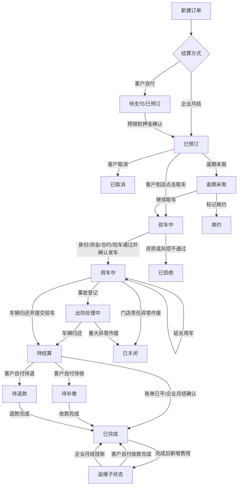

## 版本记录

| 版本 | 日期 | 调整概括 |
| --- | --- | --- |
| V1.0 | 2026-06-25 | 补充 PRD 版本记录区块，后续每次调整本文档时同步记录版本号、日期与调整概括。 |

## 1. 文档定位

本文件作为门市租车订单模块的总索引，用于统一订单主流程、子流程文档、HTML 原型文件和关键业务口径。后续讨论单个需求时，以本索引确认需求边界，再进入对应专项 PRD 和原型页面。

---

## 2. 文档清单

| 模块 | PRD 文件 | 原型文件 | 说明 |
| :--- | :--- | :--- | :--- |
| 订单状态 | 门市租车订单状态.md | store_orders.html、order_detail.html | 定义主状态、子状态、标签、筛选分组和列表展示规则。 |
| 订单列表 | 门市租车订单列表.md | store_orders.html | 定义列表字段、筛选、统计、操作列和列表跳转参数。 |
| 新建订单 | 新建订单.md | new_order.html | 定义门市创建订单、客户类型、企业优惠资格和预授权押金。 |
| 订单详情 | 订单详情.md | order_detail.html | 定义详情页信息结构、主操作区、履约事件、财务区和弹窗入口。 |
| 取车 | 订单取车.md | order_detail.html | 定义取车状态、操作锁、身份核验、预授权处理、尾款和发车。 |
| 还车 | 订单还车.md | order_detail.html | 定义验车、待结算、待补缴、待退款、企业月结和完成。 |
| 延长用车 | 延长用车.md | order_detail.html | 定义续租、逾期补办续租、费用处理和后续订单冲突。 |
| 改派 | 订单改派.md | order_detail.html | 定义取车前/用车中改派、免费升等和差价处理。 |
| 费用管理 | 费用管理.md | order_detail.html | 定义费用项、资金记录、预授权、收款、退款、月结和追缴。 |
| 事故出险 | 事故出险处理.md | order_detail.html | 定义事故登记、保险、责任归属、费用、结案和追缴。 |
| 取消关闭 | 取消与关闭订单.md | order_detail.html、store_orders.html | 定义取消、爽约、拒绝履约、关闭订单和终态规则。 |

---

## 3. 主流程全景

---

## 4. 核心业务口径

### 4.1 客户类型和结算方式

| 类型 | 费用承担 | 支付/预授权 | 还车结算 |
| :--- | :--- | :--- | :--- |
| 个人客户 | 客户本人承担 | 下单阶段按租赁业务规则收取线上预授权押金，取车阶段补足租金尾款。 | 多退少补由客户本人支付或退款。 |
| 非月结企业预订 | 客户本人承担，使用企业优惠资格和企业可用行销方案；不支持优惠券和积分。 | 与个人客户资金链路一致，下单阶段按租赁业务规则收取线上预授权押金。 | 与个人客户一致，客户后续自行向企业报销。 |
| 企业月结订单 | 企业统一承担 | 不发起客户支付和预授权，不收取取车尾款。 | 还车最终应收、终止有责费用、完成后追缴统一进入企业月结账单。 |

### 4.2 预授权和取车资金

* 本期客户自付订单下单阶段按租赁业务规则收取预授权押金，支持固定额度或租金比例；比例模式不超过 100%，不做全额支付。
* 下单预授权押金仅支持线上预授权，不支持现金押金、线下押金或仅登记线下凭证。
* 取车阶段客户需要补足租金尾款。
* 预授权支持两种处理方式：履约担保和转租金。
* 履约担保模式下，取车确认发车后释放预授权。
* 转租金模式下，预授权扣款转为租金实收，抵扣取车尾款。
* 企业月结订单不生成预授权，不展示客户支付、尾款、收款、退款入口。

### 4.3 完成后追缴

* 完成后追缴不改变订单主状态，主状态保持原终态。`completed`、`cancelled`、`no_show`、`rejected`、`closed` 都可通过追缴子状态表达后续费用处理。
* 客户自付订单追缴状态包括追缴待通知、追缴已通知、追缴待支付、追缴已结清。
* 企业月结订单完成后产生追缴费用时，费用项状态为 `monthly_billing`，系统同步生成 `monthly_bill` 交易记录，列表展示“月结已挂账”。
* 企业月结完成后追加费用按追加费用确认并生成 `monthly_bill` 的时间入账。订单 5 月完成、6 月补录 ETC、车损或停车费并确认挂账时，该追加费用进入 6 月账单；已关闭的 5 月账单不回改。

### 4.4 订单计费快照与规则快照

* 订单创建成功时，系统保存订单级基线计费快照和门市租车全局规则快照。
* 订单计费快照包含标准价版本号 `priceVersionId`、行销方案版本号 `marketingPlanVersionId`、车组标准价、行销优惠方案、增值服务价格、里程规则和创建时适用的客户/企业资格。个人订单同时保存优惠券和积分抵扣；企业身份订单不保存优惠券和积分抵扣。
* 订单规则快照包含租赁规则版本号 `rentalRuleVersionId`，以及预授权、待支付资源保留、取消、爽约、操作锁、续租、超时、提前还车和还车结算等门市租车全局规则。
* 订单后续执行预授权、取车尾款、取消、爽约、超时还车、提前还车、还车结算和完成后追缴时，以订单级基线快照为准。
* 涉及租期、车组、行销方案、价格规则、税费口径等商业条件变化的续租、改派、改还车门市等事件，必须生成事件级增量快照，并按事件发生时命中的版本结算差额，不覆盖原订单基线快照。
* 规则页面修改默认值或当前设定值后，只影响后续新建订单，不反向改写已创建订单。
* 企业月结订单同样保存规则快照；涉及客户支付、预授权、补缴、退款的规则不执行，最终费用统一进入企业月结账单。
* 订单详情页展示计费快照摘要，包含标准价版本、行销方案版本、租赁规则版本、关键计费值和创建时间，并支持查看完整快照明细。
* 续租、改派、还车结算等订单事件需要记录事件级快照，事件级快照保留当次试算使用的订单快照版本、操作时间和费用结果。

### 4.5 订单历史信息快照

订单创建和关键履约节点需要保存订单历史信息快照。订单列表、订单详情、打印单据、费用核对和历史审计默认读取订单快照字段，不直接通过主数据 ID 实时关联展示当前名称。主数据 ID 仅用于权限、筛选、统计、跳转和后续业务动作，不用于覆盖历史订单展示值。

| 快照对象 | 需要保存的历史字段 | 保存时点 |
| :--- | :--- | :--- |
| 客户信息 | 客户 ID、客户姓名、手机号、会员等级、证件类型、证件号脱敏值、风险标签。 | 订单创建成功时。 |
| 企业信息 | 企业 ID、企业名称、企业简称、结算方式、员工部门、企业资格说明。 | 使用企业资格或企业月结创建订单时。 |
| 取还门店 | 取车门店 ID、取车门店名称、取车门店地址、订单当前还车门店 ID、订单当前还车门店名称、订单当前还车门店地址、原还车门店 ID、原还车门店名称、转单后续预约冲突检查结果、被快捷改派的后续订单号。 | 订单创建成功时；改还车门店/转单时生成新的事件快照。 |
| 车组和车型 | 车组 ID、车组名称、车组别名、车型 ID、品牌、车系、年款、座位数、能源类型、变速箱。 | 订单创建成功时；改派跨车组或换车型时生成改派快照。 |
| 车辆信息 | 车辆 ID、车牌号、车辆名称、车型、车辆所属门店、派车方式、派车状态。 | 预分配、硬锁、人工改派、取车发车时分别记录派车事件快照。 |
| 行程信息 | 预计取车时间、预计还车时间、实际取车时间、实际还车时间、取车里程、还车里程、油量/电量。 | 创建、取车、还车、续租和改派时按事件记录。 |
| 订单展示信息 | 来源渠道、业务线、客户类型、结算方式、订单备注、客户备注、门店备注。 | 创建和备注更新时记录。 |

历史订单展示必须使用快照中的名称和文本。门店改名、车组改名、车型改名、企业改名、客户会员等级变化、车辆换牌或车辆归属门店变化，均不得反向改写已创建订单的展示信息。需要展示当前主数据状态时，可在详情页单独展示“当前资料”或“主数据已变更”提示，但不得替代订单快照。

### 4.6 中断和关闭窗口

| 流程 | 关闭窗口时的状态 |
| :--- | :--- |
| 取车已开始但未确认发车 | 订单保持 `inspecting`，保留取车草稿和操作锁。 |
| 取车操作锁超时 | 订单仍保持 `inspecting`，具备操作锁释放权限的人员可释放操作锁；释放后按当前时间重新判定 `reserved`、`pickup_overdue` 或 `no_show`。 |
| 还车验车未提交 | 订单保持原用车状态，不视为车辆已还。 |
| 还车验车已提交 | 订单进入 `settlement_pending`，关闭结算窗口时按待结金额进入待结算、待补缴或待退款。 |
| 事故登记关闭 | 未保存时不改变订单状态；保存后按当前主状态写入事故记录和费用。 |
| 终止类弹窗关闭 | 未确认前不改变订单状态。 |

---

## 5. 列表和详情联动

订单列表操作按钮进入详情页时，需要携带订单主状态、支付状态、企业信息、结算方式、追缴状态和目标动作。详情页读取入参后恢复模拟订单数据，并自动打开对应弹窗。

| 列表操作 | 详情动作 |
| :--- | :--- |
| 支付 | 打开下单预授权押金确认弹窗。 |
| 取车/继续取车 | 打开取车向导。 |
| 还车/继续结算/收款/退款/确认月结 | 打开还车向导或费用结算步骤。 |
| 延长用车/补办续租 | 打开延长用车弹窗。 |
| 取消/标记爽约/关闭 | 打开对应终止处理弹窗。 |
| 事故处理 | 打开事故登记弹窗。 |
| 通知客户/追缴收款/查看费用 | 打开费用管理弹窗并定位追缴费用。 |

---

## 6. 原型覆盖状态

| 页面 | 已覆盖内容 |
| :--- | :--- |
| store_orders.html | 主状态、企业月结、非月结企业预订、完成后追缴、风险标记、运营统计、筛选、操作列、跳转入参。 |
| order_detail.html | URL 入参恢复、顶部状态摘要、按钮显隐、取车、还车、续租、改派、事故、费用、取消、爽约、拒绝履约、关闭订单。 |
| new_order.html | 个人/企业客户新建订单、企业优惠资格、企业月结识别、预授权押金口径。 |

---

## 7. 后续需求拆解方式

后续每次整理需求时，按以下顺序落地：

1. 确认该需求影响的主状态、子状态和资金口径。
2. 更新对应专项 PRD。
3. 同步更新订单状态、订单列表或订单详情 PRD。
4. 更新对应 HTML 原型。
5. 在本总索引中补充跨模块口径。
