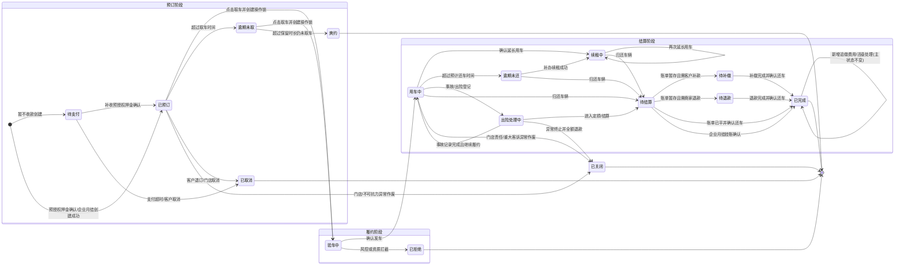

## 版本记录

| 版本 | 日期 | 调整概括 |
| --- | --- | --- |
| V1.0 | 2026-06-25 | 补充 PRD 版本记录区块，后续每次调整本文档时同步记录版本号、日期与调整概括。 |

本文档定义门市租车订单在后台管理系统中的主状态口径、视觉分层和列表筛选方式，用于支撑订单列表、订单详情、取还车作业、异常处理和费用结算。

## 1. 设计原则

* **主状态唯一**：每笔订单同一时间只能有一个主状态，用于列表标签、详情页头部状态和统计口径。
* **子状态独立**：派车状态、支付状态、追缴状态、风险标记不混入主状态，避免订单状态过度膨胀。
* **精细化展示**：订单列表行中显示最精细的主状态，便于员工判断下一步动作。
* **聚合筛选**：筛选控件按业务场景分组，可选择分组或具体状态。
* **视觉分层**：使用颜色区分紧急程度，异常风险和财务待处理状态需要明显高亮。

---

## 2. 状态全景图

---

## 3. 主状态定义

| 分组 | 状态码 | 中文显示 | 颜色 | HEX 参考 | 业务含义与员工行动指南 | 对应平台动作 |
| :--- | :--- | :--- | :--- | :--- | :--- | :--- |
| **待处理** | `pending_payment` | **待支付** | `info` Gray | `#909399` | 暂不收款创建的客户自付订单，尚未完成下单阶段预授权押金；门店需通过“支付”补收预授权押金。 | 暂不收款创建后，预授权成功前 |
| **待处理** | `reserved` | **已预订** | `primary` Blue | `#409EFF` | 订单已确认，等待取车；门店需关注备车和派车。 | 预授权押金确认后；企业月结订单创建成功后 |
| **待处理** | `pickup_overdue` | **逾期未取** | `warning` Orange | `#E67E22` | 客户超过取车时间仍未到店，但尚未判定爽约；需主动联系客户。 | 当前时间 > 预计取车时间，且未完成取车或爽约处理 |
| **履约中** | `inspecting` | **验车中** | `warning` Yellow | `#E6A23C` | 正在办理取车交接，避免其他人修改订单关键费用。 | 点击取车并创建操作锁后，未确认发车前 |
| **履约中** | `renting` | **用车中** | `success` Green | `#67C23A` | 车辆已交付，订单正常履约中。 | 取车成功后 |
| **履约中** | `renewing` | **续租中** | `success` Green | `#67C23A` | 订单已确认延长用车，新的预计还车时间已经生效；可继续延长或办理还车。 | 延长用车确认成功后 |
| **异常风险** | `overdue` | **逾期未还** | `danger` Red | `#F56C6C` | 客户超过预计还车时间仍未归还，需立即联系并启动风控。 | 当前时间 > 预计还车时间 + 订单规则快照中的超时宽限期 |
| **异常风险** | `accident_processing` | **出险处理中** | `danger` Red | `#F56C6C` | 订单发生事故或出险，需跟进定损、保险和车辆排期影响。 | 事故登记后，结算前 |
| **结算处理** | `settlement_pending` | **待结算** | `help` Purple | `#8E44AD` | 车辆已还，验车数据已提交，最终账单等待核对或等待门店完成还车确认。 | 还车 Step 1 提交验车后；账单已平但未确认还车前 |
| **结算处理** | `payment_due` | **待补缴** | `warning` Orange | `#E67E22` | 账单存在应收余额，需收款或催缴。 | 还车结算暂存或关闭时 Balance > 0 |
| **结算处理** | `refund_pending` | **待退款** | `warning` Orange | `#E67E22` | 账单存在应退余额，需财务处理退款。 | 还车结算暂存或关闭时 Balance < 0 |
| **终态** | `completed` | **已完成** | `info` Gray | `#909399` | 费用平账，订单归档；后续追缴不改变主状态。 | 账单平衡并确认还车 |
| **终态** | `cancelled` | **已取消** | `info` Gray | `#909399` | 预约阶段取消，车辆资源释放。 | 取消订单成功 |
| **终态** | `no_show` | **爽约** | `info` Gray | `#909399` | 超过保留时长仍未取车，订单进入违约终态。 | 标记爽约成功 |
| **终态** | `rejected` | **已拒绝** | `danger` Red | `#F56C6C` | 风控、证件或资质原因拒绝履约。 | 取车核验或风控拦截 |
| **终态** | `closed` | **已关闭** | `danger` Red | `#C0392B` | 客户无责并全额退款的异常作废；需高权限和审计。 | 关闭订单成功 |

---

## 4. 子状态与标签

以下信息不作为订单主状态，但应在列表、详情页或筛选中以标签、徽标或二级字段展示。

### 4.1 派车状态 `dispatchStatus`

派车状态用于表示订单与具体车辆的分配关系，不改变订单主状态。订单处于 `reserved`、`pickup_overdue`、`inspecting`、`renting`、`renewing` 等状态时，都可以同时带有派车状态。

| 字段值 | 页面显示 | 展示位置 | 说明 |
| :--- | :--- | :--- | :--- |
| `pending` | 待派车 | 车辆信息列 | 已锁车组库存，但尚未分配具体车牌。 |
| `pre_assigned` | 已预分配 | 车辆信息列 | 系统已预选车辆，仍可参与调度优化。 |
| `locked` | 已硬锁定 | 车辆信息列 | 取车前锁定具体车辆，停止自动优化。 |
| `manual_reassigned` | 人工改派 | 车辆信息列 | 店员或调度员人工调整过车辆。 |
| `upgraded` | 免费升等 | 车辆信息列 | 因门店原因或授权补偿，车辆升级但不收差价。 |

### 4.2 支付状态 `paymentStatus`

支付状态用于表示订单资金处理进度，在金额列展示。支付状态不替代订单主状态；当支付状态已经决定订单生命周期时，主状态同步进入 `pending_payment`、`payment_due` 或 `refund_pending`。

| 字段值 | 页面显示 | 展示位置 | 说明 |
| :--- | :--- | :--- | :--- |
| `unpaid` | 未支付 | 金额列 | 订单尚未产生有效收款或预授权；主状态为 `pending_payment` 时，列表和详情展示“支付”入口。 |
| `deposit_paid` | 已收预授权 | 金额列 | 下单阶段已收取租金比例预授权押金，取车时需补齐尾款。 |
| `monthly_billing` | 企业月结 | 金额列 | 企业月结订单不进入客户支付链路，不展示支付、收款和退款按钮；最终费用按还车结算或终止费用结果进入企业账单。 |
| `partial_paid` | 部分支付 | 金额列 | 已产生部分收款，仍有待收余额。 |
| `paid` | 已结清 | 金额列 | 订单当前应收款项已平账。 |
| `payment_due` | 待补缴 | 金额列 | 客户仍需补缴费用。 |
| `refund_pending` | 待退款 | 金额列 | 商家需处理退款。 |
| `refunded` | 已退款 | 金额列 | 已完成退款。 |

### 4.3 追缴状态 `postChargeStatus`

追缴状态用于表示订单进入终态后产生的违章、ETC、停车费、后发现车损、取消后有责费用补录等后续费用。追缴费用不改变订单主状态，主状态保持原终态，包括 `completed`、`cancelled`、`no_show`、`rejected` 或 `closed`。

| 字段值 | 页面显示 | 展示位置 | 说明 |
| :--- | :--- | :--- | :--- |
| `pending_notify` | 追缴待通知 | 金额列 | 客户自付订单追缴费用已创建，尚未通知客户。 |
| `notified` | 追缴已通知 | 金额列 | 客户自付订单已通过 APP、短信或人工方式完成通知。 |
| `payment_due` | 追缴待支付 | 金额列 | 客户自付订单已收到通知但尚未支付；企业月结订单不使用该状态。 |
| `monthly_billing` | 月结已挂账 | 金额列 | 企业月结订单完成后产生追缴费用，系统已生成企业月结挂账。 |
| `paid` | 追缴已结清 | 金额列 | 客户自付订单已完成收款或减免。 |

### 4.4 操作锁状态 `operationLockStatus`

操作锁状态用于表示取车、还车、费用结算等强流程作业是否被人员接管，不替代订单主状态。订单处于 `inspecting` 时，操作锁状态用于区分正常办理和取车中断；订单处于 `settlement_pending`、`payment_due`、`refund_pending` 时，操作锁状态用于区分还车结算是否正在办理。

| 字段值 | 页面显示 | 展示位置 | 说明 |
| :--- | :--- | :--- | :--- |
| `active` | 操作中 | 状态列/详情页 | 当前取车作业正在办理，操作锁未超时。 |
| `interrupted` | 取车中断 | 状态列/详情页 | 取车窗口被关闭，但未确认发车，取车草稿已保留。 |
| `expired` | 操作超时 | 状态列/详情页 | 操作锁超过有效期，原操作人可继续办理，店长或管理员可释放操作锁。 |
| `released` | 已释放 | 操作日志 | 操作锁已由店长或管理员释放，取车草稿作废，订单先回到进入取车前状态，再按当前时间重新判定是否进入逾期未取或爽约。 |

### 4.5 自助履约状态

自助履约状态用于表达 24 小时自助租车在 APP 取车、还车、车机指令和人工兜底中的进度，不替代订单主状态。订单主状态仍按预约、用车中、待结算、待补缴、待退款、已完成等业务阶段流转。

`selfPickupStatus` 用于自助取车：

| 字段值 | 页面显示 | 说明 |
| :--- | :--- | :--- |
| `not_started` | 未开始 | 用户尚未发起自助取车。 |
| `precheck_failed` | 预检失败 | 订单、车辆、GPS、车机、支付或控车权限未通过取车预检。 |
| `payment_pending` | 待支付 | 客户自付订单存在取车待付金额。 |
| `unlock_pending` | 开锁处理中 | 取车记录已提交，等待车机开锁结果。 |
| `unlock_failed` | 开锁失败 | 车机开锁失败、超时或结果未知，订单未进入用车中。 |
| `pickup_completed` | 取车完成 | 取车记录和开锁结果已闭合，订单已进入用车中。 |
| `manual_required` | 需人工处理 | 自助取车无法自动闭合，需要门店、客服或管理员处理。 |

`selfReturnStatus` 用于自助还车：

| 字段值 | 页面显示 | 说明 |
| :--- | :--- | :--- |
| `not_started` | 未开始 | 用户尚未发起自助还车。 |
| `precheck_failed` | 预检失败 | GPS、还车据点、车辆状态或车机状态未通过还车预检。 |
| `settlement_pending` | 结算处理中 | 还车记录已提交，系统正在计算费用或处理月结挂账。 |
| `payment_pending` | 待补缴 | 客户自付订单存在还车补缴金额。 |
| `refund_processing` | 退款处理中 | 客户自付订单存在应退金额，系统已发起退款或生成后台退款处理。 |
| `lock_pending` | 落锁处理中 | 结算已满足完成条件，等待车机落锁结果。 |
| `lock_failed` | 落锁失败 | 车机落锁失败、超时或结果未知，订单未完成。 |
| `return_completed` | 还车完成 | 结算、落锁和权限回收已闭合，订单已完成。 |
| `manual_required` | 需人工处理 | 自助还车无法自动闭合，需要门店、客服或管理员处理。 |

`telematicsCommandStatus` 用于记录车机指令执行结果：

| 字段值 | 说明 |
| :--- | :--- |
| `pending` | 指令待发送。 |
| `sent` | 指令已发送，等待车机回传。 |
| `success` | 车机确认执行成功。 |
| `failed` | 车机明确返回失败。 |
| `timeout` | 超过系统等待时间未收到明确结果。 |
| `unknown` | 车机返回结果无法判断是否执行成功。 |

处理口径如下：

- 支付、预授权转租金、退款受理等资金动作成功后，后续车机开锁或落锁失败，不得重复收款、重复扣款、重复退款或重复释放预授权。
- 车机开锁成功前，订单不得进入 `renting`；车机落锁成功或人工确认车辆已锁闭前，订单不得进入 `completed`。
- 车机指令重试必须使用幂等号，同一业务动作不得重复生成取车记录、还车记录、结算记录或资金记录。
- 需人工处理时，订单主状态按当前业务阶段保留，通过自助履约状态和风险标记提醒处理人员。

### 4.6 风险标记 `riskFlags`

风险标记用于表达需要门店或运营额外关注的信息，可叠加展示。风险标记不改变订单主状态。

| 字段值 | 页面显示 | 展示位置 | 说明 |
| :--- | :--- | :--- | :--- |
| `blacklist` | 黑名单 | 客户列 | 客户存在黑名单或高风险记录。 |
| `license_issue` | 证件异常 | 客户列 | 身份证、驾照、资质信息存在异常。 |
| `pickup_overdue_contact` | 需联系客户 | 客户列 | 客户超过取车时间仍未到店。 |
| `accident` | 事故上报 | 状态列/客户列 | 订单发生事故或保险报案。 |
| `violation_pending` | 违章待处理 | 金额列/状态列 | 已完成订单存在违章或后续费用线索。 |
| `dispatch_manual_required` | 人工调度 | 车辆信息列/状态列 | 智能调度无车可派、车辆临时不可用或临近取车仍未硬锁，需要调度员人工处理。 |
| `self_service_exception` | 自助异常 | 状态列/车辆信息列 | 24 小时自助取还车出现车机、支付、结算或人工兜底异常，需要门店或客服处理。 |

### 4.7 车辆启用状态与营运状态

订单状态文档需要额外说明，车辆档案中的“是否启用”和“营运状态”不属于订单主状态，也不等于派车状态。

| 维度 | 典型取值 | 作用 |
| :--- | :--- | :--- |
| 车辆启用状态 | `enabled`、`disabled` | 控制车辆是否允许参与新订单销售、自动派车、人工改派、硬锁和发车。 |
| 车辆营运状态 | `idle`、`renting`、`controlled` | 控制车辆当前时点是否空闲、已在履约中或处于内部管控。 |

订单页面的处理口径如下：

- 车辆被 `disabled` 或进入 `controlled` 时，不直接改变订单主状态。
- `reserved`、`pickup_overdue` 阶段的订单如果原已派车辆失效，应通过 `dispatchStatus` 或 `riskFlags=dispatch_manual_required` 表达人工调度需求。
- `inspecting`、`renting`、`renewing`、`overdue` 阶段的订单若车辆后续被禁用，订单仍需继续完成当前履约和还车闭环。
- 取车确认后，车辆营运状态更新为 `renting`；还车确认后，车辆按 `idle / controlled / disabled` 规则回写，与订单是否进入 `completed` 分开维护。

---

## 5. 筛选交互设计

订单状态筛选支持多选。用户可选择聚合分组，也可选择具体状态；选择分组时，系统按该分组内全部状态查询。

### 筛选器结构

1. **待处理**
   * 待支付
   * 已预订
   * 逾期未取
2. **进行中**
   * 验车中
   * 用车中
   * 续租中
3. **异常/风险**
   * 逾期未还
   * 出险处理中
4. **结算处理**
   * 待结算
   * 待补缴
   * 待退款
5. **历史订单/已结束**
   * 已完成
   * 已取消
   * 爽约
   * 已拒绝
   * 已关闭

---

## 6. 订单列表展示规则

* 订单列表的主状态列展示上述主状态标签。
* 派车状态展示在车辆信息列，位于车型、车组、车牌号下方。
* 支付状态展示在金额列，位于订单金额下方。
* 追缴状态展示在金额列。终态订单存在追缴费用时，主状态仍显示原终态，不回退为待补缴或待结算。
* 风险标记展示在客户列、车辆信息列或状态列。黑名单、证件异常展示在客户列；人工调度展示在车辆信息列或状态列；事故、违章、重大风险展示在状态列或金额列。
* `pickup_overdue`、`overdue`、`accident_processing` 应在行内高亮关键时间字段。
* `closed` 与 `cancelled` 都是终态，但含义不同：`cancelled` 是标准取消，`closed` 是高风险异常作废。
* 订单列表的操作按钮由主状态和子状态共同决定：
  * `pending_payment` 显示“支付”，点击后进入详情页并打开下单预授权押金确认弹窗。
  * `pending_payment`、`reserved`、`pickup_overdue` 显示“取消”。
  * `reserved`、`pickup_overdue` 显示“取车”。
* `pickup_overdue` 且当前时间超过预计取车时间 + 保留时长时，显示“标记爽约”。
  * `inspecting` 显示“继续取车”。
  * `renting`、`renewing` 显示“延长”。
  * `overdue` 显示“补办续租”。
  * `accident_processing` 显示“处理事故”。
  * `renting`、`renewing`、`overdue`、`accident_processing` 显示“还车”。
  * `settlement_pending` 客户自付订单显示“继续结算”，企业月结订单显示“确认月结”。
  * `payment_due` 客户自付订单显示“收款”，企业月结订单不显示该入口。
  * `refund_pending` 客户自付订单显示“退款”，企业月结订单不显示该入口。
  * `completed`、`cancelled`、`no_show`、`rejected`、`closed` 且存在 `postChargeStatus=pending_notify` 时，客户自付订单显示“通知客户”。
  * `completed`、`cancelled`、`no_show`、`rejected`、`closed` 且存在 `postChargeStatus=notified/payment_due` 时，客户自付订单显示“追缴收款”。
  * `completed`、`cancelled`、`no_show`、`rejected`、`closed` 且存在 `postChargeStatus=monthly_billing` 时，企业月结订单显示“查看费用”。
  * `cancelled`、`no_show`、`rejected`、`closed` 且不存在追缴状态时，仅显示“详情”。
* 主状态统计和子状态统计分开计算。

---

## 7. 待支付处理规则

`pending_payment` 只用于客户自付订单，包含个人预订和非月结企业预订。企业月结订单不进入 `pending_payment`，创建成功后直接进入 `reserved`，支付状态为 `monthly_billing`。

待支付订单创建成功后占用车组库存，但只在待支付资源保留时长内占用，不锁定具体车辆，不参与自动预分配、硬锁定和取车。待支付资源保留时长默认 30 分钟，按订单规则快照保存。

待支付订单点击“支付”后，详情页打开下单预授权押金确认弹窗。弹窗展示订单总额、本次预授权金额、支付渠道和凭证信息。本期仅处理预授权押金，不处理全额支付。

预授权押金确认成功后，系统写入 `pre_auth_freeze` 资金记录，支付状态更新为 `deposit_paid`，订单主状态从 `pending_payment` 更新为 `reserved`。支付失败、关闭弹窗或未继续操作时，不写入有效资金记录，订单保持 `pending_payment`，支付状态保持 `unpaid`。

待支付资源保留时长到期仍未完成预授权押金确认时，订单自动进入 `cancelled`，支付状态保持 `unpaid`，车组库存和派车关系释放，不生成取消费、爽约费或预授权资金记录。
