# 门市租赁端到端业务流程

## 版本记录

| 版本 | 日期 | 调整概括 |
| --- | --- | --- |
| V1.0 | 2026-06-25 | 补充 PRD 版本记录区块，后续每次调整本文档时同步记录版本号、日期与调整概括。 |

## 1. 文档定位

本文用于定义门市租赁从预约、派车、取车、用车、还车、结算到终态后追缴的端到端业务流程。

门市租赁包含两种模式：

- 门市租车：由门店业务员办理取车、还车、验车、收款和结算。
- 24 小时自助租车：用户在 APP 中自助取车、还车，车辆控制依赖车机。

两种模式共用车组、标准价、动态调价、行销方案、增值服务、租赁业务规则和结算规则，差异集中在取还车操作入口、操作人、车机依赖和现场服务方式。

本文不替代各功能明细 PRD。订单状态、取车、还车、改派、续租、费用管理、业务规则、调度规则仍以对应功能 PRD 为准。本文用于把门市租赁主链路串联成完整流程，方便开发理解各模块之间的关系。

## 2. 参与对象

| 对象 | 说明 |
| --- | --- |
| 用户 | APP 预约和使用车辆的人，可以是个人身份、企业非月结身份或企业月结身份 |
| APP 客户端 | 用户预约、支付、取车、控车、还车和查看订单的前台入口 |
| 门店业务员 | 办理门市租车取车、还车、验车、收款、退款、改派和异常处理的后台操作人 |
| 营运后台系统 | 订单、价格、库存、派车、状态、费用、支付、快照和操作记录的核心处理系统 |
| 车载 IoT 终端 | 24 小时自助租车及 APP 控车所依赖的车辆控制设备 |
| 支付网关 | 处理预授权、扣款、退款、预授权完成和预授权释放 |

## 3. 核心规则

### 3.1 预约对象

门市租赁用户预约的是车组，不是具体车辆。具体车辆由系统预分配、硬锁定或人工改派确定。

门市租车订单中，车辆和所在据点主要用于门店备车和履约。24 小时自助租车订单中，用户需要在 APP 中看到车牌、取车据点、楼层、车位等取车信息。

### 3.2 身份和资金规则

| 订单类型 | 下单预授权 | 取车支付 | 还车结算 | 退款 / 补缴 |
| --- | --- | --- | --- | --- |
| 个人自付 | 需要 | 自助取车前整笔订单应收金额必须结清；门市人工取车按取车尾款规则处理 | 按实际费用结算 | 用户个人补缴或退款 |
| 企业非月结 | 需要 | 自助取车前整笔订单应收金额必须由员工个人结清；门市人工取车按取车尾款规则处理 | 按实际费用结算 | 员工个人补缴或退款 |
| 企业月结 | 不需要 | 不走个人支付 | 最终应收统一挂账到企业 | 不走个人退款或补缴 |

下单阶段收取的是预授权押金，不是租金支付。预授权金额严格按租赁业务规则配置计算，可以是固定金额或租金百分比；百分比模式本期不允许超过 100%。

### 3.3 派车和硬锁

订单成立后，系统可以先做预分配。到硬锁定时间点时，系统必须执行一次自动分派或预分配复核。

派车结果分为：

| 派车结果 | 说明 |
| --- | --- |
| 预分配 | 系统为订单暂定候选车辆，用于提前规划和门店备车 |
| 已硬锁 | 车辆正式绑定订单，取车时按该车辆履约 |
| 人工调度 | 系统无法完成硬锁或存在冲突时，进入人工调度队列 |

### 3.4 订单快照

门市租赁采用“订单级基线快照 + 事件级增量快照”模型。

下单时固化订单级基线快照。后续仅涉及履约分配的动作，例如同车组派车、同车组改派、车辆停放据点记录，不生成计费快照，只写履约事件和操作记录。

后续涉及商业条件变化的动作，例如续租、改租期、改车组、取车现场更换行销方案、改还车门市或改还车据点产生费用差额、逾时重计费，需要生成事件级增量快照。

## 4. 主状态流

门市租赁主流程状态按以下方向流转：

1. 预约创建
2. 待支付 / 待预授权
3. 待排车 / 待取车
4. 验车中 / 取车办理中
5. 用车中
6. 待结算
7. 待补缴 / 待退款
8. 完成

企业月结订单在还车结算后，费用挂账完成即可进入完成。个人自付和企业非月结订单需要完成补缴或退款处理后进入完成。

完成、取消、爽约、拒绝履约、关闭等终态订单产生后续费用时，订单主状态不回退，通过独立追缴状态和费用入口处理。

## 5. 阶段一：预约与订单成立

### 5.1 服务选择

用户在 APP 选择门市租赁服务。

| 模式 | 用户选择 |
| --- | --- |
| 门市租车 | 选择取车门市、还车门市和用车时间 |
| 24 小时自助租车 | 选择取车据点、还车据点和用车时间 |

系统按服务模式、门市/据点服务状态、业务规则和库存情况返回可用车组。

### 5.2 订单试算

用户选择车组、行销方案和增值服务后，APP 请求订单试算。

系统试算内容包括：

1. 车组标准价。
2. 动态调价。
3. 行销方案。
4. 增值服务。
5. 租期规则。
6. 预授权押金。
7. 企业月结或个人支付口径。

系统返回预计租金、增值服务费、优惠结果和预授权金额。

### 5.3 创建订单

用户确认订单后，APP 发起创建订单请求。

系统需要校验：

1. 用户账号状态。
2. 驾驶资格和可租载具类型。
3. 是否存在未完成公开租赁订单。
4. 企业身份是否可用。
5. 企业月结资格是否可用。
6. 车组库存是否可用。
7. 行销方案和增值服务是否仍有效。

校验通过后，系统固化订单级基线快照，并锁定车组库存名额。

车组库存锁定按以下口径执行：

1. 每笔有效门市租赁订单固定占用 1 个车组库存名额。
2. 目标占用时间窗为取车时间减订单间隔时间，至还车时间加订单间隔时间。
3. 门市租车按取车门市下具备门市租车能力的据点汇总可服务车辆数；24 小时自助租车按用户选择的具体取车据点计算可服务车辆数。
4. 派车状态只决定是否绑定具体车辆。预分配、硬锁、人工改派和免费升等不重复增加车组库存占用。
5. 创建订单、续租、改租期、改车组和硬锁时，后端必须重新校验库存和时间窗，并在同一事务内完成占用或释放。

### 5.4 预授权处理

| 场景 | 处理 |
| --- | --- |
| 企业月结订单 | 跳过个人预授权和个人支付，订单创建成功后进入待排车 / 待取车 |
| 个人自付订单 | 创建订单后进入待支付，用户完成线上预授权后进入待排车 / 待取车 |
| 企业非月结订单 | 创建订单后进入待支付，员工个人完成线上预授权后进入待排车 / 待取车 |

预授权失败时，订单停留待支付。超过资源保留时间仍未完成预授权的订单，按规则自动取消并释放车组库存。

## 6. 阶段二：派车、预分配与硬锁

### 6.1 自动派车

订单进入待排车 / 待取车后，系统按调度规则处理车辆分配。

| 场景 | 处理 |
| --- | --- |
| 距离取车时间超过硬锁提前时间 | 可以先执行预分配，到硬锁定时间点再复核 |
| 距离取车时间已进入硬锁时间窗 | 立即执行硬锁定分派 |

### 6.2 候选车辆条件

候选车辆必须同时满足：

1. 车辆已启用。
2. 车辆营运状态允许履约。
3. 车辆服务类型匹配当前订单模式。
4. 车辆属于订单车组。
5. 订单时间窗内无冲突。
6. 车辆未处于清洁、保养、调度、事故等管控中。
7. 车辆在同车行范围内可履约。
8. 24 小时自助租车车辆需要满足车机绑定和可控要求。

### 6.3 派车结果

系统先按同车组订单调度占用时长排序，再在合法候选车辆中按车辆评分选择最优车辆。

派车成功时：

1. 写入预分配车辆或已硬锁车辆。
2. 写入派车记录和操作记录。
3. 门市租车订单在后台展示车辆和所在据点，便于门店备车。
4. 24 小时自助租车订单在 APP 展示车牌、据点、楼层和车位。

派车失败时：

1. 订单进入人工调度队列。
2. 后台提示人工派车。
3. 订单不自动取消。

### 6.4 人工改派

门店、调度或具备权限的营运人员可以发起人工改派。

改派需要校验：

1. 订单状态是否允许改派。
2. 目标车辆是否启用。
3. 目标车辆营运状态是否可用。
4. 目标车辆时间窗是否冲突。
5. 目标车辆是否同车行范围内。
6. 目标车辆是否满足车组和服务模式要求。

同车组改派只更新履约车辆，不生成计费快照。改派导致车组、价格或商业条件变化时，生成事件级计费快照并计算差额。

## 7. 阶段三：门市人工取车

### 7.1 进入取车办理

用户到店后，门店业务员在后台点击取车办理。

系统动作：

1. 创建取车操作锁。
2. 订单进入验车中 / 取车办理中。
3. 返回订单、客户、车组、车辆、费用、行销方案和核验资料。

取车窗口关闭但未提交时，订单保持验车中 / 取车办理中状态，取车操作锁保留。超过锁定时间或由有权限人员释放操作锁后，订单回到取车前状态，并按当前时间重新判断是否逾期未取或爽约。

### 7.2 身份与资格核验

门店业务员需要核对用户身份、驾驶证、订单资料和行销方案资格。

如果行销方案开启到店人工资格核验：

1. 门店核验证明文件。
2. 门店上传至少 1 个、最多 3 个证明文件。
3. 门店记录核验结果。
4. 核验通过时保留原行销方案。
5. 核验不通过时，必须更换行销方案或取消优惠。
6. 更换行销方案后生成取车事件级快照，并重算取车尾款。

### 7.3 现场增值服务

客户现场加购保险、配件或其他增值服务时，门店业务员在后台添加费用项。

系统需要重算取车应收金额，并记录费用明细。增值服务影响订单商业条件时，需要写入对应费用快照。

### 7.4 取车验车

门店业务员引导用户验车，并提交取车验车记录。

取车验车记录包括：

1. 车辆照片。
2. 车况说明。
3. 里程。
4. 油量 / 电量。
5. 交付位置。
6. 操作人。
7. 提交时间。

### 7.5 取车收款

企业月结订单不发起个人支付，不处理个人预授权。

个人自付和企业非月结订单按租赁业务规则和订单支付配置处理取车收款。

| 模式 | 处理 |
| --- | --- |
| 预授权转租金模式 | 系统发起预授权完成 / 扣款，成功后计算剩余待收尾款 |
| 履约担保模式 | 预授权继续作为履约担保，系统计算取车应收租金和增值服务尾款 |

预授权转租金失败时，保留履约担保模式，门店可以改为补收尾款后继续发车；如需继续转租金，必须重新发起扣款并成功。

取车尾款支持：

1. 线上绑卡扣款。
2. 线下 POS。
3. 现金。
4. 转账。

线下收款必须记录收款渠道、流水号、凭证、操作人和时间。

### 7.6 确认取车完成

门店业务员确认取车完成后：

1. 订单状态变更为用车中。
2. 系统开启用户 APP 控车权限。
3. 系统推送取车成功通知。
4. 门店交付车辆或钥匙。

履约担保模式下，取车成功后再释放预授权。释放失败不影响订单进入用车中，系统记录释放失败并提示人工跟进。

## 8. 阶段四：24 小时自助取车

### 8.1 取车预检

用户到达车辆旁，在 APP 点击一键取车。

系统校验：

1. 订单状态。
2. 已硬锁车辆。
3. 用户位置。
4. 车辆状态。
5. 车机在线和可控状态。
6. 费用和支付状态。

### 8.2 自助取车支付

企业月结订单跳过个人支付。

个人自付和企业非月结订单必须在自助取车前结清整笔订单应收金额。自助取车只支持线上支付或预授权转租金，不支持线下收款、到店收款或仅登记收款凭证。

自助取车待付金额按以下公式计算：

```text
自助取车待付金额 = 订单总额 - 已实际收款金额 - 预授权转租金扣款金额
```

下单阶段的预授权冻结不等同于租金支付，未转租金时不得抵扣订单总额。`自助取车待付金额 > 0` 时，APP 必须先完成支付；`自助取车待付金额 = 0` 后，系统才允许继续取车验车和车机开锁。

如需处理预授权转租金，系统自动发起预授权完成 / 扣款。处理失败时，自助取车失败，APP 提示联系门店或客服处理。

### 8.3 车机仪表值

系统读取车机最新里程、油量 / 电量，并默认带入 APP 取车验车页面。

用户需要看到：

1. 默认车机值。
2. 车机同步时间。
3. 可按现场仪表盘手动修正。

用户提交取车照片、确认或修正里程和油量 / 电量后，系统保存取车验车记录。

### 8.4 解锁和用车开始

系统保存取车验车记录后，向车机下发解锁指令。

解锁成功后：

1. 订单状态变更为用车中。
2. 系统开启用户 APP 控车权限。
3. APP 提示取车成功，用车开始。

### 8.5 自助取车异常闭环

自助取车必须同时闭合取车记录、资金记录、车机开锁和订单状态。任一环节失败时，不得通过主状态强行跳过异常。

处理规则：

1. 取车预检失败时，APP 不进入取车验车页，订单主状态不变，系统记录 `selfPickupStatus=precheck_failed`。
2. 个人自付和企业非月结订单整笔订单应收金额未结清时，系统不得保存取车验车记录，不得下发车机开锁指令。
3. 支付、预授权转租金或企业月结确认成功后，系统保留对应资金或月结记录；后续车机开锁失败时，不得重复收款、重复扣款或重复挂账。
4. 车机开锁成功前，订单不得进入用车中，用户 APP 控车权限不得生效。
5. 车机开锁失败、超时或结果未知时，订单主状态保持取车前状态，系统记录 `selfPickupStatus=unlock_failed` 或 `manual_required`，APP 提示重试或联系客服。
6. 车机开锁重试必须使用幂等号，同一取车动作不得重复生成取车记录、支付记录或状态变更。
7. 人工确认交付需要记录处理人、处理时间、处理原因和车机异常记录；人工确认后，订单才可进入用车中。

## 9. 阶段五：用车过程

### 9.1 APP 控车

用车中，用户可以在 APP 执行开锁、落锁、寻车等控车操作。

系统每次控车前都需要校验订单状态、车辆绑定关系和用户控车权限。

### 9.2 延长用车 / 续租

用户申请延长用车时，系统需要校验后续订单冲突。

| 场景 | 处理 |
| --- | --- |
| 无后续订单冲突 | 按事件发生时有效规则计算续租差额，生成续租事件级快照 |
| 存在后续订单冲突 | APP 提示当前车辆后续有订单，暂不可延长；后台可人工处理后续订单改派 |

个人自付和企业非月结订单需要支付续租差额后更新订单还车时间。企业月结订单不走个人支付，差额记录为企业月结调增。

本期不设置最大延长天数，只要没有订单冲突即可延长。

### 9.3 事故和异常

用户或门店可以提交事故、车损、异常或其他履约问题。

事故记录与改派本期不做系统强联动。是否换车或改派由门店、调度或客服线下判断，系统允许在事故处理中人工改派。

## 10. 阶段六：门市人工还车

### 10.1 进入还车办理

用户到门市归还车辆，门店业务员在后台点击还车办理。

系统创建还车操作锁，并返回订单、车辆、费用和还车资料。

### 10.2 还车验车

门店业务员与用户联合验车，并录入：

1. 实际还车时间。
2. 还车里程。
3. 油量 / 电量。
4. 车辆照片。
5. 车况说明。
6. 归还门市。
7. 归还据点、楼层、车位。
8. 额外费用说明。

还车验车提交后，订单进入待结算。

### 10.3 结算

系统按实际用车情况计算基础结算单。

结算内容包括：

1. 实际租金。
2. 续租差额。
3. 逾时费用。
4. 里程费。
5. 油量 / 电量差额。
6. 增值服务费。
7. 清洁费。
8. 车损费用。
9. 违章押金或其他费用。
10. 已收款。
11. 应补缴或应退款。

### 10.4 企业月结订单

企业月结订单结算后，最终应收统一挂账到企业。

系统动作：

1. 生成企业挂账记录。
2. 订单进入完成。
3. 回收用户 APP 控车权限。
4. 不发起个人补缴。
5. 不发起个人退款。

### 10.5 个人自付和企业非月结订单

| 结算结果 | 状态 | 后续处理 |
| --- | --- | --- |
| 需补缴 | 待补缴 | 用户线上支付或门店登记线下收款 |
| 需退款 | 待退款 | 原路退款或门店登记线下退款 |
| 无补缴 / 无退款 | 完成 | 回收控车权限并归档订单 |

补缴完成或退款处理完成后，订单进入完成，并回收用户 APP 控车权限。

退款优先原路退回。原路失败或业务需要线下处理时，允许登记线下退款。门市租赁本期不默认支持退款转积分。

## 11. 阶段七：24 小时自助还车

### 11.1 还车预检

用户到达还车点，在 APP 点击立即还车。

系统校验：

1. GPS 位置。
2. 还车据点。
3. 订单状态。
4. 车辆状态。
5. 车门、车窗、车灯和电源状态。

### 11.2 车机仪表值

系统读取车机最新里程、油量 / 电量，并默认带入 APP 还车验车页面。

用户上传还车照片，确认或修正里程、油量 / 电量后，提交还车信息。

### 11.3 自助还车结算

系统保存还车验车记录后，订单进入待结算，并计算最终费用。系统必须先完成补/退租金结算，再下发车机落锁指令。

| 场景 | 处理 |
| --- | --- |
| 企业月结订单 | 最终应收挂账到企业，落锁成功后订单完成 |
| 个人自付 / 企业非月结需补缴 | 用户线上支付补缴金额后，系统落锁并完成订单 |
| 个人自付 / 企业非月结需退款 | 系统发起原路退款或生成后台退款处理记录，落锁成功后订单完成 |
| 无补缴 / 无退款 | 系统落锁并完成订单 |

自助还车只支持线上补缴。需要线下处理时，用户需要联系门店或客服。

### 11.4 落锁和权限回收

系统确认结算可以完成后，向车机下发落锁指令。

落锁成功后：

1. 回收用户 APP 控车权限。
2. 订单状态变更为完成。
3. APP 提示还车成功。

### 11.5 自助还车异常闭环

自助还车必须同时闭合还车验车记录、费用结算、资金处理、车机落锁、控车权限回收和订单完成状态。

处理规则：

1. 还车预检失败时，APP 不进入还车提交页，订单主状态不变，系统记录 `selfReturnStatus=precheck_failed`。
2. 用户提交还车记录后，订单进入待结算；企业月结挂账、客户补缴、退款受理或账单平衡记录完成后，才允许进入落锁步骤。
3. 补缴成功、退款受理成功或企业月结挂账成功后，系统保留资金或月结记录；后续落锁失败时，不得重复收款、重复退款或重复挂账。
4. 车机落锁成功或人工确认车辆已锁闭前，订单不得进入完成，用户 APP 控车权限不得回收为完成结果。
5. 车机落锁失败、超时或结果未知时，订单保持待结算、待补缴或待退款中的对应状态，系统记录 `selfReturnStatus=lock_failed` 或 `manual_required`，APP 提示用户检查车门车窗或联系客服。
6. 车机落锁重试必须使用幂等号，同一还车动作不得重复生成还车记录、结算记录、资金记录、月结记录或订单完成状态。
7. 人工确认还车需要记录处理人、处理时间、处理原因、车辆实际状态和车机异常记录；人工确认后，系统回收控车权限并完成订单。

## 12. 阶段八：终态后追缴

完成、取消、爽约、拒绝履约、关闭等终态订单后，如果产生违章、ETC、停车费、车损、清洁费或其他延迟费用，按追缴处理。

追缴规则：

1. 订单主状态不回退。
2. 系统生成独立追缴费用和追缴状态。
3. 需要记录追缴原因、金额、凭证、操作人和时间。
4. 需要通知用户或企业。

| 订单类型 | 追缴处理 |
| --- | --- |
| 企业月结订单 | 追缴费用挂账到企业 |
| 个人自付订单 | 用户线上补缴或后台登记线下收款 |
| 企业非月结订单 | 员工个人线上补缴或后台登记线下收款 |

系统不默认自动代扣追缴费用。后续如支持签约代扣，需要单独定义授权协议、通知规则、扣款失败处理和争议处理。

## 13. 异常处理

| 异常 | 处理 |
| --- | --- |
| 预授权失败 | 订单停留待支付，超过资源保留时间自动取消 |
| 硬锁失败 | 进入人工调度队列，不自动取消订单 |
| 取车窗口关闭未提交 | 订单保持验车中 / 取车办理中，操作锁保留 |
| 取车操作锁超时 | 有权限人员可释放锁，订单回到取车前状态并重新判断逾期未取或爽约 |
| 行销资格核验不通过 | 必须更换行销方案或取消优惠，生成事件级快照并重算尾款 |
| 预授权转租金失败 | 保留履约担保模式，可补收尾款后继续发车；继续转租金必须重试成功 |
| 履约担保释放预授权失败 | 不影响订单进入用车中，记录失败并提示人工跟进 |
| 24 小时自助车机值读取失败 | APP 提示未获取车机值，允许用户人工录入 |
| 24 小时自助解锁失败 | 订单不进入用车中，已成功支付或预授权转租金记录保留且不得重复扣款；APP 提示重试或联系客服，后台进入自助取车异常处理 |
| 24 小时自助解锁结果未知 | 订单不进入用车中，系统先查询车机最终结果；仍无法确认时进入人工处理 |
| 24 小时自助落锁失败 | 订单不进入完成，已成功补缴、退款受理或月结挂账记录保留且不得重复处理；APP 提示用户检查车门车窗或联系客服，后台进入自助还车异常处理 |
| 24 小时自助落锁结果未知 | 订单不进入完成，系统先查询车机最终结果；仍无法确认时进入人工处理 |
| 还车产生补缴 | 进入待补缴，支付或线下收款完成后进入完成 |
| 还车产生退款 | 进入待退款，退款处理完成后进入完成 |
| 终态后产生费用 | 生成独立追缴状态，订单主状态不回退 |

## 14. 操作记录要求

以下动作必须写入业务操作记录：

1. 创建订单。
2. 预授权成功、失败、取消。
3. 车组库存锁定和释放。
4. 自动预分配。
5. 硬锁车辆。
6. 人工改派。
7. 取车办理开始。
8. 取车操作锁释放。
9. 资格核验结果。
10. 更换行销方案。
11. 添加增值服务。
12. 取车验车提交。
13. 取车收款。
14. 预授权转租金。
15. 预授权释放。
16. 确认取车完成。
17. APP 控车权限开启和回收。
18. 续租。
19. 事故或异常登记。
20. 还车办理开始。
21. 还车验车提交。
22. 结算确认。
23. 补缴。
24. 退款。
25. 企业月结挂账。
26. 订单完成。
27. 终态后追缴。
28. 自助取车预检失败、开锁指令发送、开锁成功、开锁失败、开锁超时、开锁结果未知和人工确认交付。
29. 自助还车预检失败、落锁指令发送、落锁成功、落锁失败、落锁超时、落锁结果未知和人工确认还车。

系统自动动作也需要写入业务操作记录。

## 15. 验收标准

1. 门市租车和 24 小时自助租车均按车组预约。
2. 个人自付和企业非月结订单下单时执行线上预授权。
3. 企业月结订单不发起个人预授权、个人支付和个人退款。
4. 订单成立后可以预分配，到硬锁定时间点必须执行硬锁复核。
5. 硬锁失败时进入人工调度队列，不自动取消订单。
6. 门市人工取车点击办理后，订单进入验车中 / 取车办理中，并创建操作锁。
7. 取车窗口关闭未提交时，订单状态和操作锁按规则保留。
8. 到店资格核验支持上传最多 3 个证明文件。
9. 资格核验不通过时，必须更换行销方案或取消优惠，并生成事件级快照。
10. 取车成功后订单进入用车中，并开启用户 APP 控车权限。
11. 履约担保模式下，取车成功后释放预授权；释放失败不影响订单进入用车中。
12. 24 小时自助取车和还车默认带入车机里程、油量 / 电量，并允许人工修正。
13. 续租按事件发生时有效规则计算差额，并生成事件级快照。
14. 还车验车提交后进入待结算。
15. 个人自付和企业非月结订单根据结算结果进入待补缴、待退款或完成。
16. 企业月结订单最终应收统一挂账到企业后进入完成。
17. 订单完成后必须回收用户 APP 控车权限。
18. 终态后追缴不回退订单主状态，通过独立追缴状态处理。

## 16. 时序图

```plantuml
@startuml
title 门市租赁（门市租车 / 24小时自助租车）端到端业务时序图
autonumber

actor "用户" as User
participant "APP客户端" as App
participant "门店业务员" as Staff
participant "营运后台系统" as System
participant "车载IoT终端" as Car
participant "支付网关" as Pay

note over User, System: 阶段一：预约、计费试算与订单成立

User -> App: 选择门市租赁服务
alt 门市租车
    App -> System: 查询支持门市租车的门市
    System --> App: 返回门市列表
    User -> App: 选择取车门市、还车门市、用车时间
else 24小时自助租车
    App -> System: 查询支持24小时自助的据点
    System --> App: 返回可预约据点列表
    User -> App: 选择取车据点、还车据点、用车时间
end

App -> System: 查询可用车组
System -> System: 校验门市/据点服务状态、车组库存、业务规则
System --> App: 返回可用车组、价格和行销方案

User -> App: 选择车组、行销方案、增值服务
App -> System: 请求订单试算
System -> System: 试算租金、增值服务费、优惠和预授权金额
System --> App: 返回预计费用和预授权金额

User -> App: 确认订单
App -> System: 创建订单
System -> System: 校验账号、驾驶资格、未完成订单、企业资格、车组库存
System -> System: 固化订单级基线快照并锁定车组库存
alt 企业月结订单
    System -> System: 跳过个人预授权和个人支付
    System --> App: 订单创建成功，待排车/待取车
else 个人自付 / 企业非月结订单
    System --> App: 订单创建成功，待支付，返回预授权金额
    User -> App: 确认预授权
    App -> System: 发起预授权
    System -> Pay: 预授权冻结
    Pay --> System: 预授权成功
    System -> System: 状态变更为待排车/待取车
    System --> App: 预约成功
end

note over System: 阶段二：派车、预分配与硬锁

alt 超过硬锁提前时间
    System -> System: 可先执行预分配，等待硬锁复核
else 进入硬锁时间窗
    System -> System: 立即执行硬锁分派
end
System -> System: 检索车组内可履约车辆
System -> System: 按订单占用时长排序并计算车辆评分
alt 找到车辆
    System -> System: 写入预分配或已硬锁车辆
    alt 24小时自助租车
        System --> App: 展示车牌、据点、楼层/车位
    else 门市租车
        System --> Staff: 展示备车车辆和所在据点
    end
else 无可用车辆
    System -> System: 进入人工调度队列
    System --> Staff: 提醒人工派车
end

note over User, Car: 阶段三：取车

alt 门市人工取车
    User -> Staff: 到店办理取车
    Staff -> System: 点击取车办理
    System -> System: 创建取车操作锁，状态变更为验车中/取车办理中
    System --> Staff: 返回订单、客户、车辆、费用和核验资料
    Staff -> User: 核对身份、驾驶证和行销资格
    opt 行销方案需要到店核验
        Staff -> System: 上传证明文件并记录核验结果
        alt 核验不通过
            Staff -> System: 更换行销方案或取消优惠
            System -> System: 生成取车事件级快照并重算尾款
        end
    end
    Staff -> System: 提交取车验车记录
    Staff -> System: 请求取车应收试算
    alt 企业月结订单
        System --> Staff: 返回企业月结确认结果
    else 个人自付 / 企业非月结订单
        alt 预授权转租金模式
            System -> Pay: 预授权完成/扣款
            Pay --> System: 返回处理结果
        else 履约担保模式
            System -> System: 预授权继续作为履约担保
        end
        System --> Staff: 返回本次待收金额
        Staff -> System: 线上扣款或录入线下收款
    end
    Staff -> System: 确认取车完成
    System -> System: 状态变更为用车中，开启APP控车权限
    opt 履约担保模式
        System -> Pay: 取车成功后释放预授权
        Pay --> System: 返回释放结果
    end
    System --> App: 推送取车成功
else 24小时自助取车
    User -> App: 点击一键取车
    App -> System: 请求取车预检
    System -> System: 校验订单、车辆、GPS、车机和费用状态
    opt 个人自付/企业非月结需支付
        App -> System: 发起线上扣款
        System -> Pay: 执行扣款
        Pay --> System: 扣款成功
    end
    System -> Car: 读取车机最新里程、油量/电量
    Car --> System: 返回车机实时值
    System --> App: 返回取车验车页，默认带入车机值
    User -> App: 上传取车照片并确认或修正仪表值
    App -> System: 提交取车验车单
    System -> Car: 下发解锁指令
    Car --> System: 解锁成功
    System -> System: 状态变更为用车中，开启APP控车权限
    System --> App: 取车成功
end

note over User, Car: 阶段四：用车过程

User -> App: 开锁/落锁/寻车
App -> System: 发送控车指令
System -> System: 校验订单状态和控车权限
System -> Car: 转发指令
Car --> System: 返回执行结果
System --> App: 返回操作结果

opt 延长用车
    User -> App: 申请延长用车
    App -> System: 请求续租试算
    System -> System: 校验后续订单冲突并计算差额
    alt 企业月结订单
        System -> System: 差额记录为企业月结调增，更新还车时间
    else 个人自付/企业非月结订单
        App -> System: 支付续租差额
        System -> Pay: 执行扣款
        Pay --> System: 扣款成功
        System -> System: 更新还车时间
    end
    System -> System: 生成续租事件级快照
    System --> App: 续租成功
end

note over User, Car: 阶段五：还车与结算

alt 门市人工还车
    User -> Staff: 到门市归还车辆
    Staff -> System: 点击还车办理
    System -> System: 创建还车操作锁
    Staff -> System: 提交还车验车记录、实际时间、里程、油量和归还据点
    System -> System: 状态变更为待结算并计算最终费用
    opt 添加额外费用
        Staff -> System: 添加清洁、车损、违章、油电差额等费用
    end
    Staff -> System: 确认结算
    alt 企业月结订单
        System -> System: 最终应收挂账到企业，状态变更为完成，回收控车权限
    else 需补缴
        System -> System: 状态变更为待补缴
        Staff -> System: 线上扣款或录入线下收款
        System -> System: 状态变更为完成，回收控车权限
    else 需退款
        System -> System: 状态变更为待退款
        Staff -> System: 发起原路退款或录入线下退款
        System -> System: 状态变更为完成，回收控车权限
    else 无差额
        System -> System: 状态变更为完成，回收控车权限
    end
else 24小时自助还车
    User -> App: 点击立即还车
    App -> System: 请求还车预检
    System -> Car: 查询车辆状态并读取车机仪表值
    Car --> System: 返回状态和里程/油量/电量
    System --> App: 返回还车验车页，默认带入车机值
    User -> App: 上传还车照片并确认或修正仪表值
    App -> System: 提交还车信息并请求结算
    System -> System: 状态变更为待结算并计算最终费用
    alt 企业月结订单
        System -> System: 最终应收挂账到企业
    else 需补缴
        App -> System: 用户线上支付补缴金额
        System -> Pay: 执行扣款
        Pay --> System: 扣款成功
    else 需退款
        System -> Pay: 发起原路退款或生成后台退款处理记录
        Pay --> System: 退款受理成功
    end
    System -> Car: 下发落锁指令
    Car --> System: 锁定成功
    System -> System: 回收控车权限，状态变更为完成
    System --> App: 还车成功
end

note over Staff, App: 阶段六：终态后追缴

Staff -> System: 在历史订单中新增追缴费用
System -> System: 记录原因、金额、凭证、操作人，生成独立追缴状态
alt 企业月结订单
    System -> System: 追缴费用挂账到企业
else 个人自付/企业非月结订单
    System --> App: 推送追缴通知
    alt 用户线上补缴
        App -> System: 发起支付
        System -> Pay: 执行扣款
        Pay --> System: 扣款成功
    else 后台线下收款
        Staff -> System: 录入线下收款记录
    end
    System -> System: 追缴状态变更为已结清
end

@enduml
```



## 17. Markdown 可显示时序图

以下为 Mermaid 版本时序图，用于在支持 Mermaid 的 Markdown 工具中直接显示。

```mermaid
sequenceDiagram
    autonumber
    actor User as 用户
    participant App as APP客户端
    participant Staff as 门店业务员
    participant System as 营运后台系统
    participant Car as 车载IoT终端
    participant Pay as 支付网关

    Note over User,System: 阶段一：预约、计费试算与订单成立
    User->>App: 选择门市租赁服务
    alt 门市租车
        App->>System: 查询支持门市租车的门市
        System-->>App: 返回门市列表
        User->>App: 选择取车门市、还车门市、用车时间
    else 24小时自助租车
        App->>System: 查询支持24小时自助的据点
        System-->>App: 返回可预约据点列表
        User->>App: 选择取车据点、还车据点、用车时间
    end

    App->>System: 查询可用车组
    System->>System: 校验门市/据点服务状态、车组库存、业务规则
    System-->>App: 返回可用车组、价格和行销方案
    User->>App: 选择车组、行销方案、增值服务
    App->>System: 请求订单试算
    System->>System: 试算租金、增值服务费、优惠和预授权金额
    System-->>App: 返回预计费用和预授权金额

    User->>App: 确认订单
    App->>System: 创建订单
    System->>System: 校验账号、驾驶资格、未完成订单、企业资格、车组库存
    System->>System: 固化订单级基线快照并锁定车组库存
    alt 企业月结订单
        System->>System: 跳过个人预授权和个人支付
        System-->>App: 订单创建成功，待排车/待取车
    else 个人自付 / 企业非月结订单
        System-->>App: 订单创建成功，待支付，返回预授权金额
        User->>App: 确认预授权
        App->>System: 发起预授权
        System->>Pay: 预授权冻结
        Pay-->>System: 预授权成功
        System->>System: 状态变更为待排车/待取车
        System-->>App: 预约成功
    end

    Note over System: 阶段二：派车、预分配与硬锁
    alt 超过硬锁提前时间
        System->>System: 可先执行预分配，等待硬锁复核
    else 进入硬锁时间窗
        System->>System: 立即执行硬锁分派
    end
    System->>System: 检索车组内可履约车辆
    System->>System: 按订单占用时长排序并计算车辆评分
    alt 找到车辆
        System->>System: 写入预分配或已硬锁车辆
        alt 24小时自助租车
            System-->>App: 展示车牌、据点、楼层/车位
        else 门市租车
            System-->>Staff: 展示备车车辆和所在据点
        end
    else 无可用车辆
        System->>System: 进入人工调度队列
        System-->>Staff: 提醒人工派车
    end

    opt 人工改派
        Staff->>System: 发起改派
        System->>System: 校验订单状态、车辆可用性、同车行范围、后续订单冲突
        alt 同车组改派
            System->>System: 更新履约车辆，不生成计费快照
        else 改派导致车组或价格变化
            System->>System: 生成事件级计费快照并计算差额
        end
        System-->>Staff: 改派完成
    end

    Note over User,Car: 阶段三：取车
    alt 门市人工取车
        User->>Staff: 到店办理取车
        Staff->>System: 点击取车办理
        System->>System: 创建取车操作锁，状态变更为验车中/取车办理中
        System-->>Staff: 返回订单、客户、车辆、费用和核验资料

        opt 取车窗口关闭但未提交
            Note over System: 订单保持验车中/取车办理中，操作锁保留；超时或释放后回到取车前状态
        end

        Staff->>User: 核对身份、驾驶证和行销资格
        opt 行销方案需要到店核验
            Staff->>System: 上传证明文件并记录核验结果
            alt 核验通过
                System->>System: 保留原行销方案
            else 核验不通过
                Staff->>System: 更换行销方案或取消优惠
                System->>System: 生成取车事件级快照并重算尾款
            end
        end

        opt 客户现场增加增值服务
            Staff->>System: 添加保险/配件等增值服务
            System->>System: 重算取车应收金额并记录费用明细
        end

        Staff->>System: 提交取车验车记录
        Staff->>System: 请求取车应收试算
        alt 企业月结订单
            System-->>Staff: 返回企业月结确认结果
        else 个人自付 / 企业非月结订单
            alt 预授权转租金模式
                System->>Pay: 预授权完成/扣款
                alt 转租金成功
                    Pay-->>System: 扣款成功
                    System->>System: 计算剩余待收尾款
                else 转租金失败
                    Pay-->>System: 扣款失败
                    System-->>Staff: 可改为补收尾款后继续发车；继续转租金需重试成功
                end
            else 履约担保模式
                System->>System: 预授权继续作为履约担保
                System->>System: 计算取车应收租金/增值服务尾款
            end
            System-->>Staff: 返回本次待收金额
            Staff->>System: 线上扣款或录入线下收款
        end

        Staff->>System: 确认取车完成
        System->>System: 状态变更为用车中，开启APP控车权限
        opt 履约担保模式且非月结订单
            System->>Pay: 取车成功后释放预授权
            alt 释放成功
                Pay-->>System: 释放成功
            else 释放失败
                Pay-->>System: 释放失败
                System->>System: 记录释放失败，提示人工跟进；不影响用车中
            end
        end
        System-->>Staff: 取车完成
        System-->>App: 推送取车成功，用车开始
        Staff-->>User: 交付车辆/钥匙

    else 24小时自助取车
        User->>App: 点击一键取车
        App->>System: 请求取车预检
        System->>System: 校验订单、车辆、GPS、车机和费用状态
        alt 企业月结订单
            System->>System: 跳过个人支付
        else 个人自付 / 企业非月结订单
            System->>System: 计算取车待付金额
            System-->>App: 返回待付金额
            opt 待付金额大于0
                User->>App: 确认线上支付
                App->>System: 发起线上扣款
                System->>Pay: 执行扣款
                Pay-->>System: 扣款成功
            end
            opt 需要预授权转租金
                System->>Pay: 发起预授权完成/扣款
                alt 成功
                    Pay-->>System: 处理成功
                else 失败
                    Pay-->>System: 处理失败
                    System-->>App: 自助取车失败，请联系门店或客服处理
                end
            end
        end
        System->>Car: 读取车机最新里程、油量/电量
        Car-->>System: 返回车机实时值
        System-->>App: 返回取车验车页，里程/油量默认带入车机值
        App-->>User: 展示默认车机值，提示可按现场仪表修正
        User->>App: 上传取车照片并确认或修正仪表值
        App->>System: 提交取车验车单
        System->>Car: 下发解锁指令
        Car-->>System: 解锁成功
        System->>System: 状态变更为用车中，开启APP控车权限
        System-->>App: 取车成功，用车开始
    end

    Note over User,Car: 阶段四：用车过程
    User->>App: 开锁/落锁/寻车
    App->>System: 发送控车指令
    System->>System: 校验订单状态和控车权限
    System->>Car: 转发指令
    Car-->>System: 返回执行结果
    System-->>App: 返回操作结果

    opt 延长用车/续租
        User->>App: 申请延长用车
        App->>System: 请求续租试算
        System->>System: 校验后续订单冲突
        alt 存在后续订单冲突
            System-->>App: 当前车辆后续有订单，暂不可延长
            opt 后台人工改派后续订单
                Staff->>System: 快捷改派后续订单
                System->>System: 后续冲突解除后允许续租
            end
        else 无后续冲突
            System->>System: 按事件发生时规则计算续租差额
            System->>System: 生成续租事件级快照
            alt 企业月结订单
                System->>System: 差额记录为企业月结调增，更新还车时间
                System-->>App: 续租成功
            else 个人自付 / 企业非月结订单
                System-->>App: 返回需支付差额
                User->>App: 确认支付
                App->>System: 发起线上支付
                System->>Pay: 执行扣款
                Pay-->>System: 扣款成功
                System->>System: 更新还车时间
                System-->>App: 续租成功
            end
        end
    end

    opt 事故/异常登记
        User->>App: 上报事故或异常
        App->>System: 提交事故信息、照片、说明
        System->>System: 生成事故记录
        Note over System: 事故与改派本期不做系统强联动，是否换车由门店、调度或客服线下判断
    end

    Note over User,Car: 阶段五：还车与结算
    alt 门市人工还车
        User->>Staff: 到门市归还车辆
        Staff->>System: 点击还车办理
        System->>System: 创建还车操作锁
        System-->>Staff: 返回订单、车辆、费用和还车资料
        Staff->>User: 联合验车
        Staff->>System: 提交还车验车记录、实际时间、里程、油量、归还据点/车位
        System->>System: 状态变更为待结算并计算基础结算单
        opt 存在额外费用
            Staff->>System: 添加清洁、车损、违章、油电差额等费用
            System->>System: 汇总计算最终费用
        end
        Staff->>System: 确认结算
        alt 企业月结订单
            System->>System: 最终应收挂账到企业
            System->>System: 状态变更为完成，回收APP控车权限
            System-->>Staff: 还车完成，企业月结挂账完成
        else 需补缴
            System->>System: 状态变更为待补缴
            System-->>Staff: 返回补缴金额
            Staff->>System: 线上扣款或录入线下收款
            System->>System: 状态变更为完成，回收APP控车权限
        else 需退款
            System->>System: 状态变更为待退款
            System-->>Staff: 返回退款金额
            Staff->>System: 发起原路退款或录入线下退款
            System->>System: 状态变更为完成，回收APP控车权限
        else 无需补缴或退款
            System->>System: 状态变更为完成，回收APP控车权限
        end

    else 24小时自助还车
        User->>App: 点击立即还车
        App->>System: 请求还车预检
        System->>System: 校验GPS、还车据点、车辆状态、订单状态
        System->>Car: 查询车辆状态并读取车机仪表值
        Car-->>System: 返回状态和里程/油量/电量
        System-->>App: 返回还车验车页，默认带入车机值
        App-->>User: 展示默认车机值，提示可按现场仪表修正
        User->>App: 上传还车照片并确认或修正仪表值
        App->>System: 提交还车信息并请求结算
        System->>System: 状态变更为待结算并计算最终费用
        alt 企业月结订单
            System->>System: 最终应收挂账到企业
        else 需补缴
            System->>System: 状态变更为待补缴
            System-->>App: 返回补缴金额
            User->>App: 确认线上支付
            App->>System: 发起线上支付
            System->>Pay: 执行扣款
            Pay-->>System: 扣款成功
        else 需退款
            System->>System: 状态变更为待退款
            System->>Pay: 发起原路退款或生成后台退款处理记录
            Pay-->>System: 退款受理成功
        end
        System->>Car: 下发落锁指令
        Car-->>System: 锁定成功
        System->>System: 回收APP控车权限，状态变更为完成
        System-->>App: 还车成功
    end

    Note over Staff,App: 阶段六：终态后追缴
    Staff->>System: 在历史订单中新增追缴费用
    System->>System: 记录原因、金额、凭证、操作人，生成独立追缴状态
    alt 企业月结订单
        System->>System: 追缴费用挂账到企业
        System-->>Staff: 追缴挂账完成
    else 个人自付 / 企业非月结订单
        System-->>App: 推送追缴通知、费用明细和凭证
        alt 用户线上补缴
            User->>App: 确认支付
            App->>System: 发起支付
            System->>Pay: 执行扣款
            Pay-->>System: 扣款成功
            System->>System: 追缴状态变更为已结清
        else 后台线下收款
            Staff->>System: 录入线下收款记录、流水号、凭证
            System->>System: 追缴状态变更为已结清
        end
    end

    Note over System: 影响商业条件的动作生成事件级快照；纯履约动作只写履约事件和操作记录
```


